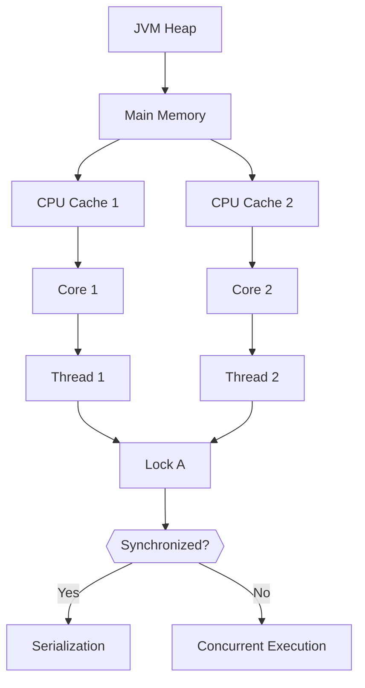

### **Java Concurrency Interview Questions**

_Premium Senior Backend Engineer Revision Notes_

---

## 📚 Question Organization

|Level|Questions|Focus Areas|
|---|---|---|
|**Beginner**|1-20|Core syntax, lifecycle, basic sync|
|**Intermediate**|21-50|Locks, executors, collections|
|**Advanced**|51-80|JMM, lock-free, ForkJoin, reactivity|
|**Senior**|81-100|Deadlock resolution, tuning, distributed systems|

---

## 1. Beginner Level (1-20)

### **Table: Core Concepts**

|#|Question|Concise Answer|Tradeoffs|Internal Behavior|Production Considerations|Common Follow-ups|
|---|---|---|---|---|---|---|
|**1**|`synchronized`vs `ReentrantLock`|`synchronized` is simpler; `ReentrantLock` offers fairness, try-lock, condition vars.|`synchronized`: no explicit fairness; `ReentrantLock`: configurable fairness → higher overhead.|`synchronized` uses JVM monitors; `ReentrantLock` is explicit `java.util.concurrent` lock.|Prefer `ReentrantLock` for complex sync (e.g., timed waits); use `synchronized` for short critical sections.|How to avoid deadlock with `ReentrantLock`? What happens on `lock()` reentrancy?|
|**2**|`volatile` vs `AtomicInteger`|`volatile` guarantees visibility; `AtomicInteger` provides atomic operations (CAS).|`volatile`: no atomic compound ops; `AtomicInteger`: CAS loops → overhead for contention.|`volatile` adds _acquire/release_semantics; `AtomicInteger` uses _Compare-And-Swap_ via `sun.misc.Unsafe`.|Use `volatile` for simple flags (e.g., stop signal); `AtomicInteger` for counters.|Why not use `volatile` for all shared variables? Explain `ABA` problem.|
|**3**|`wait()` vs `sleep()`|`wait()` releases lock; `sleep()`does not.|`wait()` requires re-acquisition of lock → risk of starvation; `sleep()`is interruptible.|`wait()` puts thread in **WAITING** state; `sleep()` puts in **TIMED_WAITING**.|Never call `wait()` outside synchronized block → `IllegalMonitorStateException`.|How to guard against spurious wakeups? Why `notify()` may fail to wake threads?|
|**4**|`Runnable` vs `Callable`|`Runnable`: no return value; `Callable`: returns value/throws `Exception`.|`Callable` requires handling `Future` → more boilerplate.|`Callable` implements `Callabe<v>`interface; `Runnable` is legacy.|Use `Callable` when tasks need results (e.g., async HTTP calls).|When to prefer `ExecutorService.submit(Runnable)`over `submit(Callable)`?|
|**5**|Thread states|**New → Runnable → Blocked → Waiting → Timed Waiting → Terminated**.|Starvation occurs in **Runnable** if not scheduled.|JVM tracks states via `Thread.state`; transitions via native calls.|Monitor thread dumps for **BLOCKED**threads to find lock contention.|How does `Thread.yield()` affect state transitions?|

---

## 2. Intermediate Level (21-50)

### **Table: Executors & Collections**

|#|Question|Concise Answer|Tradeoffs|Internal Behavior|Production Considerations|Common Follow-ups|
|---|---|---|---|---|---|---|
|**21**|`ExecutorService`shutdown|Graceful: `shutdown()` → await termination; forceful: `shutdownNow()`.|`shutdownNow()` may interrupt tasks → incomplete work.|`shutdown()` sets `shutdown` flag; `awaitTermination()` blocks until workers drain.|Always call `shutdown()` in `finally`; avoid orphaned threads → resource leaks.|What if `awaitTermination()` times out? How to handle task rejection?|
|**22**|`ConcurrentHashMap`vs `HashMap`|`CHM` is thread-safe via segment locking; `HashMap` not safe.|`CHM` has lower throughput under high write contention.|Uses _lock striping_ (since JDK 8: CAS + node-based).|Use for shared caches; avoid with high write contention → use `StampedLock`.|Why `ConcurrentHashMap.putIfAbsent()`is atomic? How resizing works.|
|**23**|`Future` vs `CompletableFuture`|`Future` blocks; `CompletableFuture` chains async actions without blocking.|Chaining `CompletableFuture` depth → stack overflow risk.|`CompletableFuture` uses `ForkJoinPool.commonPool()` for async execution.|Prefer for async pipelines (e.g., microservice calls); handle exceptions with `exceptionally()`.|When to use `thenApply()` vs `thenCompose()`? Explain `async()` vs `complete()`.|
|**24**|`BlockingQueue`patterns|Producer-consumer, bounded buffers, backpressure.|Unbounded queues → OOM; bounded queues → task rejection.|`put()` blocks when full; `take()` blocks when empty.|Use `ArrayBlockingQueue` for bounded; `LinkedBlockingQueue` for unbounded.|How to implement a rate limiter using `BlockingQueue`?|
|**25**|`ReadWriteLock` use cases|Readers access concurrently; writers get exclusive access.|Writer starvation if reads are frequent.|Uses separate read/write locks; reentrant by same thread.|Ideal for read-heavy caches (e.g., product catalog).|How to prevent writer starvation? What is `fair` parameter impact?|

---

## 3. Advanced Level (51-80)

### **Table: JMM & Lock-Free**

|#|Question|Concise Answer|Tradeoffs|Internal Behavior|Production Considerations|Common Follow-ups|
|---|---|---|---|---|---|---|
|**51**|Java Memory Model (JMM)|Defines _happens-before_ rules for visibility and ordering.|Weak guarantees → require `volatile`/`synchronized`for safety.|Compiler/JVM may reorder instructions; _acquire/release_semantics enforce order.|Use `volatile` for simple flags; avoid assumptions on non-volatile fields.|Explain `final` semantics. How does `Thread.start()`affect visibility?|
|**52**|CAS & `ABA`problem|CAS compares-and-swaps; `ABA` fails when value changes back to original.|`ABA` breaks atomicity → require version stamps or `AtomicReferenceAndInt`.|`Unsafe.compareAndSwapInt()`; `ABA` occurs when value: A → B → A.|Use `AtomicStampedInteger` for counters with inversion.|How does `AtomicMarkableReference`solve `ABA`?|
|**53**|`ForkJoinPool`work stealing|Tasks split recursively; idle threads steal work from busy threads.|Overhead for small tasks → use `parallelismThreshold`.|Uses _work queues_; main thread owns a queue; steal from others when empty.|Tune `parallelismLevel` = `Runtime.getRuntime().availableProcessors()`.|Why not use `ForkJoinPool`for all async tasks?|
|**54**|Reactivity & backpressure|Non-blocking streams; backpressure signals congestion to upstream.|Overwhelming downstream → buffer bloat → OOM.|Project Reactor: `Flux`/`Mono`; RxJava: `Flowable` with `onBackpressureBuffer()`.|Use in high-throughput pipelines (e.g., event streams).|Compare Reactor vs RxJava error strategies.|
|**55**|Deadlock detection|Use `ThreadMXBean.findDeadlockedThreads()`; JVM dumps show `LOCKED` states.|Detection is reactive → deadlock may already cause outage.|JVM tracks lock graphs; cycles indicate deadlocks.|Monitor withWatchdog timers; avoid nested locks; use `tryLock(timeout)`.|How to simulate deadlock for testing?|

---

## 4. Senior Level (81-100)

### **Table: Performance & Debugging**

|#|Question|Concise Answer|Tradeoffs|Internal Behavior|Production Considerations|Common Follow-ups|
|---|---|---|---|---|---|---|
|**81**|Thread dump analysis|`jstack`/`jcmd` → inspect **BLOCKED**, **WAITING**, lock owners.|Manual parsing error-prone → use tools (VisualVM, JProfiler).|JVM writes stack traces for all threads; locks via `java.monitor` entries.|Capture dumps during CPU spikes; correlate with GC logs.|How to identify **LIVELOCK** vs **DEADLOCK**?|
|**82**|Parallel streams pitfalls|Parallelization overhead for small collections; stateful intermediates break.|Over-parallelism → contention; under-parallelism → no gain.|Uses `ForkJoinPool.commonPool()`; splits work via `Spliterator`.|Limit parallelism: `stream().parallel().unordered()`; avoid `shared mutable state`.|When to suppress ordering? How to handle non-thread-safe collectors?|
|**83**|JVM memory visibility|Changes to `volatile` fields flush to main memory; non-volatile may be cached.|`volatile` adds performance cost (~2x).|Write to `volatile` → _release_; read → _acquire_.|Use `volatile` only for simple signals; avoid for complex invariants.|How does `ThreadLocal` affect visibility?|
|**84**|`CompletableFuture`chaining|`thenApply()` → transform; `thenCompose()` → flatMap async.|Deep chains → callback hell; use `exceptionally()` for error handling.|Async execution via `ForkJoinPool`; each stage is a new `CompletableFuture`.|Handle time-outs with `orTimeout()`; avoid blocking inside stages.|Why not use `CompletableFuture.allOf()`for independent tasks?|
|**85**|Distributed deadlock|Occurs across services (e.g., DB locks, message queues).|Hard to detect → require distributed tracing.|Use idempotent operations; compensate via Sagas.|Implement **dead-letter queues**; monitor service-level locks.|How to design a deadlock-free distributed transaction?|

---

## 🔧 **Key Takeaways**

|Area|Interview Tip|Common Mistake|Production Insight|
|---|---|---|---|
|**JMM**|Always tie visibility to _happens-before_ relationships.|Assuming `final` or constructor writes are visible without synchronization.|Use `volatile` for single flags; `Atomic` classes for counters.|
|**Lock-Free**|Prefer CAS for counters; use stamped locks for complex invariants.|Ignoring `ABA` → atomicity breaches.|`AtomicStampedInteger` solves `ABA`; benchmark contention levels.|
|**Executors**|Shutdown gracefully; avoid `shutdownNow()` unless urgent.|Forgetting to `shutdown()` → thread leaks.|Use `ThreadPoolExecutor` with reject handlers; tune queue sizes.|
|**Debugging**|Thread dumps are first-resort for deadlocks/contention.|Misreading **BLOCKED** as CPU-bound.|Correlate with GC logs; use `jcmd GC.heap_info`.|
|**Performance**|Tune parallelism: `ForkJoinPool` for divide-and-conquer; avoid for IO-bound.|Over-parallelizing small tasks → overhead dominates.|Monitor **lock contention** via `LockSupport.parkCount`; use `jvisualvm`.|

> **Final Tip**: _"In interviews, always discuss tradeoffs and production realities – not just API."_

_Memory Model Interaction Example_