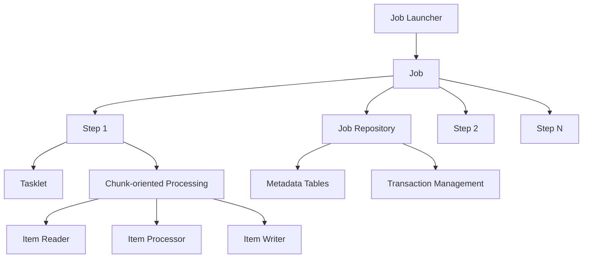
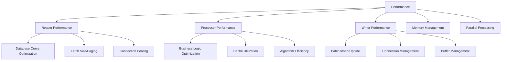
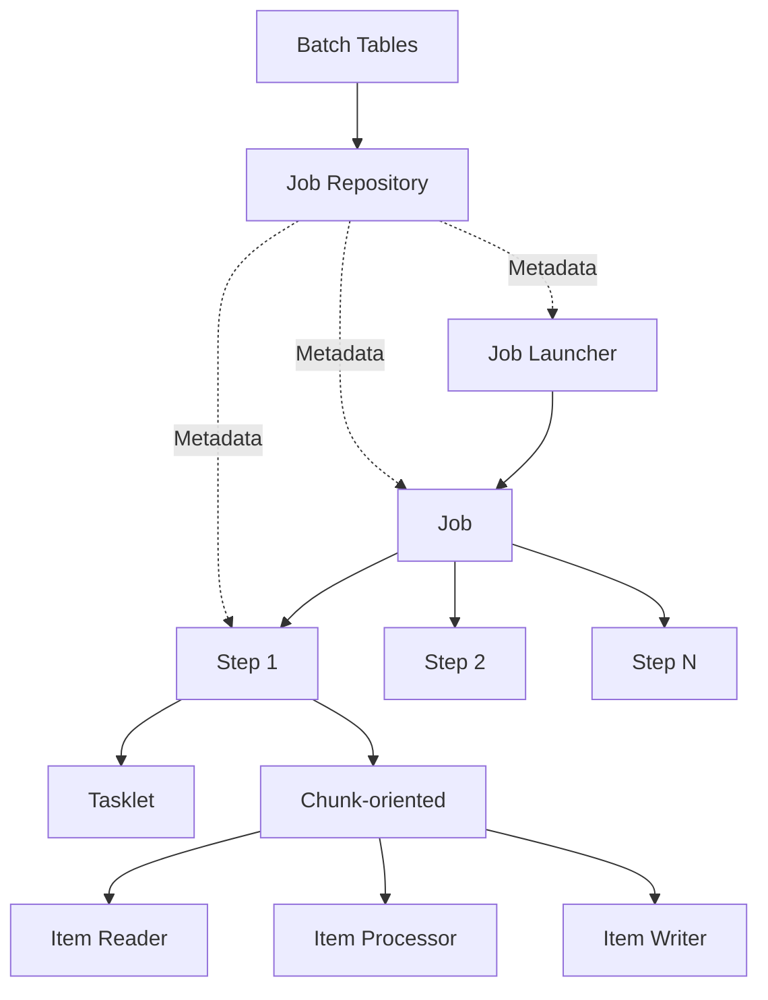

- [[#Architecture Overview|Architecture Overview]]
- [[#Reader Patterns|Reader Patterns]]
- [[#Processor Patterns|Processor Patterns]]
- [[#Writer Patterns|Writer Patterns]]
- [[#Step Execution Patterns|Step Execution Patterns]]
- [[#Error Handling & Recovery|Error Handling & Recovery]]
- [[#Performance Optimization|Performance Optimization]]
- [[#Transaction Management|Transaction Management]]
- [[#Job Scheduling & Orchestration|Job Scheduling & Orchestration]]
- [[#Monitoring & Observability|Monitoring & Observability]]
- [[#Best Practices Summary|Best Practices Summary]]
- [[#Common Anti-patterns to Avoid|Common Anti-patterns to Avoid]]
- [[#Interview Discussion Points|Interview Discussion Points]]
- [[#Performance Architecture|Performance Architecture]]
- [[#Reader Performance Optimization|Reader Performance Optimization]]
- [[#Processor Performance Optimization|Processor Performance Optimization]]
- [[#Writer Performance Optimization|Writer Performance Optimization]]
- [[#Memory Management|Memory Management]]
- [[#Parallel Processing Optimization|Parallel Processing Optimization]]
- [[#Performance Monitoring & Metrics|Performance Monitoring & Metrics]]
- [[#Database Optimization|Database Optimization]]
- [[#Performance Patterns Summary|Performance Patterns Summary]]
- [[#Key Takeaways for Interviews|Key Takeaways for Interviews]]
- [[#Common Performance Anti-patterns|Common Performance Anti-patterns]]
- [[#Core Concepts & Architecture|Core Concepts & Architecture]]
- [[#Reader Patterns|Reader Patterns]]
- [[#Processor Patterns|Processor Patterns]]
- [[#Writer Patterns|Writer Patterns]]
- [[#Error Handling & Recovery|Error Handling & Recovery]]
- [[#Performance & Scaling|Performance & Scaling]]
- [[#Advanced Topics|Advanced Topics]]
- [[#Production & Operations|Production & Operations]]
- [[#Scenario-Based Questions|Scenario-Based Questions]]
- [[#Quick-Fire Questions & Answers|Quick-Fire Questions & Answers]]
- [[#Interview Red Flags & Green Flags|Interview Red Flags & Green Flags]]
- [[#Final Tips for Senior Interviews|Final Tips for Senior Interviews]]
- [[#Core Concepts|Core Concepts]]
- [[#Configuration Patterns|Configuration Patterns]]
- [[#Reader Patterns Cheatsheet|Reader Patterns Cheatsheet]]
- [[#Processor Patterns Cheatsheet|Processor Patterns Cheatsheet]]
- [[#Writer Patterns Cheatsheet|Writer Patterns Cheatsheet]]
- [[#Error Handling Quick Reference|Error Handling Quick Reference]]
- [[#Performance Optimization Cheatsheet|Performance Optimization Cheatsheet]]
- [[#Monitoring & Observability|Monitoring & Observability]]
- [[#Common Patterns Quick Reference|Common Patterns Quick Reference]]
- [[#Production Considerations Checklist|Production Considerations Checklist]]
- [[#Common Problems & Solutions|Common Problems & Solutions]]
- [[#Performance Tuning Quick Guide|Performance Tuning Quick Guide]]
- [[#Quick Decision Trees|Quick Decision Trees]]
- [[#Interview Questions Quick Reference|Interview Questions Quick Reference]]
- [[#Anti-patterns to Avoid|Anti-patterns to Avoid]]
- [[#Best Practices Summary|Best Practices Summary]]
- [[#Key Takeaways|Key Takeaways]]

# Spring Batch - Core Concepts
*Production-Grade Batch Processing Guide*

## Architecture Overview

### Core Components


**Key Components**:
1. **Job**: Complete batch process (contains steps)
2. **Step**: Independent phase of a Job
3. **JobRepository**: Persists batch metadata
4. **JobLauncher**: Starts jobs with parameters
5. **ItemReader**: Reads input data
6. **ItemProcessor**: Processes/transforms data
7. **ItemWriter**: Writes output data

### Job Configuration Pattern
```java
@Configuration
@EnableBatchProcessing
public class BatchJobConfig {
    
    @Bean
    public Job importUserJob(JobRepository jobRepository,
                             Step importStep) {
        return new JobBuilder("importUserJob", jobRepository)
            .incrementer(new RunIdIncrementer())
            .start(importStep)
            .next(anotherStep)
            .on("COMPLETED").to(successStep)
            .on("FAILED").to(failureStep)
            .end()
            .build();
    }
    
    @Bean
    public Step importStep(JobRepository jobRepository,
                           PlatformTransactionManager txManager,
                           ItemReader<User> reader,
                           ItemProcessor<User, UserDTO> processor,
                           ItemWriter<UserDTO> writer) {
        return new StepBuilder("importStep", jobRepository)
            .<User, UserDTO>chunk(1000, txManager) // Processing chunk size
            .reader(reader)
            .processor(processor)
            .writer(writer)
            .faultTolerant()
            .skipLimit(10)
            .skip(Exception.class)
            .retryLimit(3)
            .retry(DeadlockLoserDataAccessException.class)
            .listener(new StepExecutionListener())
            .build();
    }
}
```

## Reader Patterns

### Database Readers
```java
// JPA Reader
@Bean
@StepScope
public JpaPagingItemReader<User> jpaReader(
        EntityManagerFactory entityManagerFactory,
        @Value("#{jobParameters['date']}") String date) {
    
    return new JpaPagingItemReaderBuilder<User>()
        .name("userReader")
        .entityManagerFactory(entityManagerFactory)
        .queryString("SELECT u FROM User u WHERE u.createdDate >= :date")
        .parameterValues(Map.of("date", LocalDate.parse(date)))
        .pageSize(1000)
        .build();
}

// JDBC Reader (Cursor-based for large datasets)
@Bean
@StepScope
public JdbcCursorItemReader<User> jdbcCursorReader(
        DataSource dataSource,
        @Value("#{jobParameters['status']}") String status) {
    
    return new JdbcCursorItemReaderBuilder<User>()
        .name("userCursorReader")
        .dataSource(dataSource)
        .sql("SELECT * FROM users WHERE status = ?")
        .rowMapper(new BeanPropertyRowMapper<>(User.class))
        .preparedStatementSetter(new ArgumentPreparedStatementSetter(
            new Object[]{status}
        ))
        .fetchSize(1000)
        .build();
}

// JDBC Reader (Paging for memory efficiency)
@Bean
@StepScope
public JdbcPagingItemReader<User> jdbcPagingReader(
        DataSource dataSource,
        PagingQueryProvider queryProvider) {
    
    return new JdbcPagingItemReaderBuilder<User>()
        .name("userPagingReader")
        .dataSource(dataSource)
        .queryProvider(queryProvider)
        .pageSize(1000)
        .rowMapper(new BeanPropertyRowMapper<>(User.class))
        .build();
}
```

**Performance Considerations**:
- **Cursor-based**: Better for ordered reads, but holds connection
- **Paging**: Releases connection between pages, better for large datasets
- **Fetch size**: Tune based on memory and network

### File Readers
```java
// Flat File Reader (CSV)
@Bean
@StepScope
public FlatFileItemReader<User> csvFileReader(
        @Value("#{jobParameters['inputFile']}") Resource inputFile) {
    
    return new FlatFileItemReaderBuilder<User>()
        .name("csvFileReader")
        .resource(inputFile)
        .delimited()
        .names("id", "name", "email", "age")
        .fieldSetMapper(new BeanWrapperFieldSetMapper<User>() {{
            setTargetType(User.class);
        }})
        .linesToSkip(1) // Skip header
        .skippedLinesCallback(new HeaderCallbackHandler())
        .strict(false) // Don't fail if file missing
        .build();
}

// JSON Reader
@Bean
@StepScope
public JsonItemReader<User> jsonReader(
        @Value("#{jobParameters['inputFile']}") Resource inputFile,
        ObjectMapper objectMapper) {
    
    return new JsonItemReaderBuilder<User>()
        .name("jsonReader")
        .resource(inputFile)
        .jsonObjectReader(new JacksonJsonObjectReader<>(User.class, objectMapper))
        .build();
}

// Multi-resource Reader (Multiple files)
@Bean
@StepScope
public MultiResourceItemReader<User> multiResourceReader(
        @Value("#{jobParameters['inputPath']}") Resource[] resources) {
    
    return new MultiResourceItemReaderBuilder<User>()
        .name("multiResourceReader")
        .resources(resources)
        .delegate(new FlatFileItemReaderBuilder<User>()
            .name("delegateReader")
            .delimited()
            .names("id", "name", "email")
            .fieldSetMapper(new BeanWrapperFieldSetMapper<>() {{
                setTargetType(User.class);
            }})
            .build())
        .build();
}
```

### Custom Readers
```java
// Retryable Reader for unreliable sources
@Component
@StepScope
public class RetryableRestItemReader implements ItemReader<User>, 
                                                ItemStreamReader<User> {
    
    private final RestTemplate restTemplate;
    private final String apiUrl;
    private List<User> currentPage;
    private int currentIndex = 0;
    private int pageNumber = 0;
    private final int pageSize = 100;
    
    @Override
    public User read() throws Exception {
        if (currentPage == null || currentIndex >= currentPage.size()) {
            currentPage = fetchNextPageWithRetry();
            currentIndex = 0;
        }
        
        if (currentPage.isEmpty()) {
            return null; // No more data
        }
        
        return currentPage.get(currentIndex++);
    }
    
    private List<User> fetchNextPageWithRetry() {
        int attempts = 0;
        while (attempts < 3) {
            try {
                User[] users = restTemplate.getForObject(
                    apiUrl + "?page=" + pageNumber + "&size=" + pageSize,
                    User[].class
                );
                pageNumber++;
                return Arrays.asList(users != null ? users : new User[0]);
            } catch (RestClientException e) {
                attempts++;
                if (attempts == 3) throw e;
                try {
                    Thread.sleep(1000 * attempts); // Exponential backoff
                } catch (InterruptedException ie) {
                    Thread.currentThread().interrupt();
                    throw new RuntimeException(ie);
                }
            }
        }
        return Collections.emptyList();
    }
    
    @Override
    public void open(ExecutionContext executionContext) {
        this.pageNumber = executionContext.getInt("pageNumber", 0);
    }
    
    @Override
    public void update(ExecutionContext executionContext) {
        executionContext.putInt("pageNumber", pageNumber);
    }
}
```

## Processor Patterns

### Validation & Transformation
```java
@Component
@StepScope
public class UserValidationProcessor implements ItemProcessor<User, UserDTO> {
    
    private final Validator validator;
    private final MetricsService metrics;
    
    @Override
    public UserDTO process(User user) throws Exception {
        // Validation
        Set<ConstraintViolation<User>> violations = validator.validate(user);
        if (!violations.isEmpty()) {
            metrics.increment("validation.errors");
            throw new ValidationException("Invalid user: " + 
                violations.stream()
                    .map(ConstraintViolation::getMessage)
                    .collect(Collectors.joining(", ")));
        }
        
        // Business logic transformation
        UserDTO dto = new UserDTO();
        dto.setUserId(user.getId());
        dto.setFullName(user.getFirstName() + " " + user.getLastName());
        dto.setEmail(user.getEmail().toLowerCase());
        dto.setAge(calculateAge(user.getBirthDate()));
        
        // Enrichment (cache lookup)
        Region region = regionCache.get(user.getZipCode());
        if (region != null) {
            dto.setRegion(region.getName());
        }
        
        return dto;
    }
    
    private int calculateAge(LocalDate birthDate) {
        return Period.between(birthDate, LocalDate.now()).getYears();
    }
}
```

### Composite & Filtering Processors
```java
@Component
public class CompositeUserProcessor implements ItemProcessor<User, UserDTO> {
    
    private final List<ItemProcessor<User, UserDTO>> processors;
    
    public CompositeUserProcessor(List<ItemProcessor<User, UserDTO>> processors) {
        this.processors = processors;
    }
    
    @Override
    public UserDTO process(User item) throws Exception {
        UserDTO result = null;
        for (ItemProcessor<User, UserDTO> processor : processors) {
            result = processor.process(item);
            if (result == null) {
                return null; // Filtered out
            }
            // Pass result to next processor
            if (processor instanceof DelegatingItemProcessor) {
                // Handle delegation
            }
        }
        return result;
    }
}

// Filtering processor
@Component
public class AgeFilterProcessor implements ItemProcessor<User, User> {
    
    @Override
    public User process(User user) throws Exception {
        if (user.getAge() < 18 || user.getAge() > 65) {
            return null; // Filter out
        }
        return user;
    }
}

// Enrichment processor
@Component
@StepScope
public class UserEnrichmentProcessor implements ItemProcessor<User, User> {
    
    private final UserRepository userRepository;
    private final CacheManager cacheManager;
    
    @Override
    public User process(User user) throws Exception {
        // Database enrichment
        UserDetails details = userRepository.findDetails(user.getId());
        if (details != null) {
            user.setPreferences(details.getPreferences());
        }
        
        // Cache enrichment
        Cache cache = cacheManager.getCache("userStats");
        UserStats stats = cache.get(user.getId(), UserStats.class);
        if (stats != null) {
            user.setLastLogin(stats.getLastLogin());
        }
        
        return user;
    }
}
```

### Async Processing
```java
@Configuration
public class AsyncProcessingConfig {
    
    @Bean
    public AsyncItemProcessor<User, UserDTO> asyncProcessor(
            ItemProcessor<User, UserDTO> delegate) {
        AsyncItemProcessor<User, UserDTO> processor = new AsyncItemProcessor<>();
        processor.setDelegate(delegate);
        processor.setTaskExecutor(asyncTaskExecutor());
        return processor;
    }
    
    @Bean
    public TaskExecutor asyncTaskExecutor() {
        ThreadPoolTaskExecutor executor = new ThreadPoolTaskExecutor();
        executor.setCorePoolSize(10);
        executor.setMaxPoolSize(50);
        executor.setQueueCapacity(1000);
        executor.setThreadNamePrefix("batch-async-");
        executor.initialize();
        return executor;
    }
    
    @Bean
    public AsyncItemWriter<UserDTO> asyncWriter(
            ItemWriter<UserDTO> delegate) {
        AsyncItemWriter<UserDTO> writer = new AsyncItemWriter<>();
        writer.setDelegate(delegate);
        return writer;
    }
}
```

## Writer Patterns

### Database Writers
```java
// JPA Writer with bulk insert
@Component
public class JpaBatchWriter implements ItemWriter<User> {
    
    private final EntityManager entityManager;
    private final int batchSize = 100;
    private int count = 0;
    
    @Override
    @Transactional
    public void write(List<? extends User> items) throws Exception {
        for (User user : items) {
            entityManager.persist(user);
            count++;
            
            if (count % batchSize == 0) {
                entityManager.flush();
                entityManager.clear();
            }
        }
        entityManager.flush();
        entityManager.clear();
    }
}

// JDBC Batch Writer
@Bean
public JdbcBatchItemWriter<User> jdbcBatchWriter(DataSource dataSource) {
    return new JdbcBatchItemWriterBuilder<User>()
        .dataSource(dataSource)
        .sql("INSERT INTO users (id, name, email) VALUES (:id, :name, :email)")
        .itemSqlParameterSourceProvider(new BeanPropertyItemSqlParameterSourceProvider<>())
        .assertUpdates(false) // Don't fail if no rows updated
        .build();
}

// Repository Writer
@Component
public class RepositoryWriter implements ItemWriter<User> {
    
    private final UserRepository userRepository;
    
    @Override
    @Transactional
    public void write(List<? extends User> items) throws Exception {
        userRepository.saveAll(items);
    }
}
```

### File Writers
```java
// CSV Writer
@Bean
@StepScope
public FlatFileItemWriter<UserDTO> csvFileWriter(
        @Value("#{jobParameters['outputFile']}") Resource outputFile) {
    
    return new FlatFileItemWriterBuilder<UserDTO>()
        .name("csvFileWriter")
        .resource(outputFile)
        .delimited()
        .delimiter(",")
        .names("id", "name", "email", "age")
        .headerCallback(writer -> writer.write("ID,NAME,EMAIL,AGE"))
        .footerCallback(writer -> writer.write(
            "Total processed: " + getStepExecution().getWriteCount()))
        .shouldDeleteIfEmpty(true)
        .build();
}

// JSON Writer
@Bean
@StepScope  
public JsonFileItemWriter<UserDTO> jsonFileWriter(
        @Value("#{jobParameters['outputFile']}") Resource outputFile,
        ObjectMapper objectMapper) {
    
    return new JsonFileItemWriterBuilder<UserDTO>()
        .name("jsonFileWriter")
        .resource(outputFile)
        .jsonObjectMarshaller(new JacksonJsonObjectMarshaller<>(objectMapper))
        .build();
}

// Multi-resource Writer
@Bean
@StepScope
public MultiResourceItemWriter<UserDTO> multiResourceWriter(
        @Value("#{jobParameters['outputPath']}") Resource outputDir) {
    
    return new MultiResourceItemWriterBuilder<UserDTO>()
        .name("multiResourceWriter")
        .resource(outputDir)
        .resourceSuffixCreator(new SimpleResourceSuffixCreator())
        .itemCountLimitPerResource(10000) // 10k records per file
        .delegate(new FlatFileItemWriterBuilder<UserDTO>()
            .name("delegateWriter")
            .delimited()
            .names("id", "name", "email")
            .build())
        .build();
}
```

### Custom Writers
```java
// Retryable REST API Writer
@Component
public class RetryableRestWriter implements ItemWriter<UserDTO> {
    
    private final RestTemplate restTemplate;
    private final String apiUrl;
    private final RetryTemplate retryTemplate;
    
    public RetryableRestWriter() {
        this.retryTemplate = RetryTemplate.builder()
            .maxAttempts(3)
            .fixedBackoff(1000)
            .retryOn(ResourceAccessException.class)
            .build();
    }
    
    @Override
    public void write(List<? extends UserDTO> items) throws Exception {
        retryTemplate.execute(context -> {
            try {
                ResponseEntity<String> response = restTemplate.postForEntity(
                    apiUrl + "/batch",
                    items,
                    String.class
                );
                
                if (!response.getStatusCode().is2xxSuccessful()) {
                    throw new IOException("API call failed: " + response.getStatusCode());
                }
                
                return null;
            } catch (RestClientException e) {
                context.setAttribute(RetryContext.EXHAUSTED, true);
                throw e;
            }
        });
    }
}

// Composite Writer
@Component
public class CompositeUserWriter implements ItemWriter<User> {
    
    private final List<ItemWriter<User>> writers;
    
    public CompositeUserWriter(List<ItemWriter<User>> writers) {
        this.writers = writers;
    }
    
    @Override
    public void write(List<? extends User> items) throws Exception {
        for (ItemWriter<User> writer : writers) {
            writer.write(items);
        }
    }
}

// Partitioning Writer for Sharded Databases
@Component
@StepScope
public class ShardedDatabaseWriter implements ItemWriter<User> {
    
    private final Map<String, DataSource> shards;
    private final JdbcTemplate jdbcTemplate;
    
    @Override
    public void write(List<? extends User> items) throws Exception {
        // Group by shard key
        Map<String, List<User>> itemsByShard = items.stream()
            .collect(Collectors.groupingBy(user -> 
                determineShard(user.getId())));
        
        // Write to each shard
        for (Map.Entry<String, List<User>> entry : itemsByShard.entrySet()) {
            DataSource shardDataSource = shards.get(entry.getKey());
            writeToShard(shardDataSource, entry.getValue());
        }
    }
    
    private void writeToShard(DataSource dataSource, List<User> users) {
        JdbcTemplate shardTemplate = new JdbcTemplate(dataSource);
        
        String sql = "INSERT INTO users (id, name, email) VALUES (?, ?, ?)";
        List<Object[]> batchArgs = users.stream()
            .map(user -> new Object[]{user.getId(), user.getName(), user.getEmail()})
            .collect(Collectors.toList());
        
        shardTemplate.batchUpdate(sql, batchArgs);
    }
    
    private String determineShard(String userId) {
        int hash = Math.abs(userId.hashCode());
        return "shard_" + (hash % 10); // 10 shards
    }
}
```

## Step Execution Patterns

### Tasklet Steps (Non-chunked)
```java
@Bean
public Step cleanupStep(JobRepository jobRepository,
                        PlatformTransactionManager txManager) {
    return new StepBuilder("cleanupStep", jobRepository)
        .tasklet(cleanupTasklet(), txManager)
        .build();
}

@Bean
public Tasklet cleanupTasklet() {
    return new Tasklet() {
        @Override
        public RepeatStatus execute(StepContribution contribution,
                                   ChunkContext chunkContext) throws Exception {
            
            // Single operation (not chunk-based)
            cleanupService.cleanupOldData();
            auditService.logCleanup();
            
            return RepeatStatus.FINISHED;
        }
    };
}

// System Command Tasklet
@Bean
public Tasklet systemCommandTasklet() {
    return new SystemCommandTasklet() {{
        setCommand("bash backup.sh");
        setTimeout(300000); // 5 minutes
        setWorkingDirectory("/tmp");
        setSystemProcessExitCodeMapper(new SimpleSystemProcessExitCodeMapper());
        setTerminationCheckInterval(5000);
    }};
}

// Callable Tasklet for Async Operations
@Bean
public Tasklet asyncTasklet() {
    return (contribution, chunkContext) -> {
        CompletableFuture<Void> future = CompletableFuture.runAsync(() -> {
            // Long-running async operation
            processLargeFile();
        });
        
        future.get(30, TimeUnit.MINUTES); // Wait with timeout
        return RepeatStatus.FINISHED;
    };
}
```

### Conditional Flow & Decision Steps
```java
@Bean
public Job conditionalJob(JobRepository jobRepository,
                         Step firstStep,
                         Step successStep,
                         Step failureStep,
                         Step decisionStep) {
    return new JobBuilder("conditionalJob", jobRepository)
        .start(firstStep)
        .next(decisionStep)
        .on("COMPLETED").to(successStep)
        .on("FAILED").to(failureStep)
        .from(decisionStep)
        .on("*").stop() // Any other status
        .end()
        .build();
}

@Bean
public Step decisionStep(JobRepository jobRepository) {
    return new StepBuilder("decisionStep", jobRepository)
        .partitioner("slaveStep", partitioner())
        .gridSize(10)
        .taskExecutor(taskExecutor())
        .build();
}

@Bean
public JobExecutionDecider weekendDecider() {
    return (jobExecution, stepExecution) -> {
        Calendar calendar = Calendar.getInstance();
        int day = calendar.get(Calendar.DAY_OF_WEEK);
        
        if (day == Calendar.SATURDAY || day == Calendar.SUNDAY) {
            return new FlowExecutionStatus("WEEKEND");
        } else {
            return new FlowExecutionStatus("WEEKDAY");
        }
    };
}
```

### Partitioning for Parallel Processing
```java
@Bean
public Step partitionedStep(JobRepository jobRepository,
                            PlatformTransactionManager txManager) {
    return new StepBuilder("partitionedStep", jobRepository)
        .partitioner("slaveStep", rangePartitioner())
        .gridSize(10) // Number of partitions
        .taskExecutor(taskExecutor()) // Parallel execution
        .step(slaveStep(jobRepository, txManager))
        .build();
}

@Bean
public Partitioner rangePartitioner() {
    return new Partitioner() {
        @Override
        public Map<String, ExecutionContext> partition(int gridSize) {
            Map<String, ExecutionContext> result = new HashMap<>();
            
            // Calculate ranges for each partition
            int totalRecords = 1000000;
            int recordsPerPartition = totalRecords / gridSize;
            
            for (int i = 0; i < gridSize; i++) {
                ExecutionContext context = new ExecutionContext();
                int start = i * recordsPerPartition + 1;
                int end = (i == gridSize - 1) ? totalRecords : (i + 1) * recordsPerPartition;
                
                context.putInt("start", start);
                context.putInt("end", end);
                context.putString("partition", "partition_" + i);
                
                result.put("partition" + i, context);
            }
            
            return result;
        }
    };
}

@Bean
public Step slaveStep(JobRepository jobRepository,
                      PlatformTransactionManager txManager) {
    return new StepBuilder("slaveStep", jobRepository)
        .<User, UserDTO>chunk(1000, txManager)
        .reader(partitionAwareReader())
        .processor(processor())
        .writer(writer())
        .build();
}

@Bean
@StepScope
public ItemReader<User> partitionAwareReader(
        @Value("#{stepExecutionContext['start']}") int start,
        @Value("#{stepExecutionContext['end']}") int end) {
    
    return new JdbcPagingItemReaderBuilder<User>()
        .name("partitionReader")
        .dataSource(dataSource)
        .queryProvider(createQueryProvider(start, end))
        .pageSize(1000)
        .rowMapper(new BeanPropertyRowMapper<>(User.class))
        .build();
}
```

## Error Handling & Recovery

### Skip, Retry & Rollback Configuration
```java
@Bean
public Step faultTolerantStep(JobRepository jobRepository,
                              PlatformTransactionManager txManager) {
    return new StepBuilder("faultTolerantStep", jobRepository)
        .<User, UserDTO>chunk(1000, txManager)
        .reader(reader())
        .processor(processor())
        .writer(writer())
        .faultTolerant()
        
        // Skip configuration
        .skipLimit(100) // Maximum skips per chunk
        .skip(DataIntegrityViolationException.class)
        .skip(DeadlockLoserDataAccessException.class)
        .skip(ValidationException.class)
        .noSkip(IOException.class) // Never skip IO exceptions
        
        // Retry configuration
        .retryLimit(3)
        .retry(OptimisticLockingFailureException.class)
        .retry(DeadlockLoserDataAccessException.class)
        .noRetry(NullPointerException.class) // Never retry NPE
        .retryPolicy(new SimpleRetryPolicy(3)) // Custom retry policy
        
        // Rollback configuration
        .rollbackLimit(2) // Maximum rollbacks per chunk
        .noRollback(ValidationException.class) // Don't rollback for validation errors
        
        // Skip listener
        .listener(new SkipListener() {
            @Override
            public void onSkipInRead(Throwable t) {
                log.error("Skipped item during read: {}", t.getMessage());
                metrics.increment("skip.read");
            }
            
            @Override
            public void onSkipInProcess(User item, Throwable t) {
                log.warn("Skipped item during processing: {}", item.getId(), t);
                metrics.increment("skip.process");
                // Log skipped item for later review
                skipLogService.logSkippedItem(item, t);
            }
            
            @Override
            public void onSkipInWrite(UserDTO item, Throwable t) {
                log.error("Skipped item during write: {}", item.getUserId(), t);
                metrics.increment("skip.write");
            }
        })
        
        .build();
}
```

### Custom Retry Policy
```java
@Component
public class ExponentialBackoffRetryPolicy extends RetryPolicySupport {
    
    private final MetricsService metrics;
    
    @Override
    public boolean canRetry(RetryContext context) {
        Throwable lastThrowable = context.getLastThrowable();
        
        // Don't retry certain exceptions
        if (lastThrowable instanceof NullPointerException ||
            lastThrowable instanceof IllegalArgumentException) {
            return false;
        }
        
        // Calculate backoff
        int retryCount = context.getRetryCount();
        if (retryCount >= 5) { // Max 5 retries
            return false;
        }
        
        // Exponential backoff
        try {
            long backoffMillis = (long) Math.pow(2, retryCount) * 1000;
            Thread.sleep(backoffMillis);
        } catch (InterruptedException e) {
            Thread.currentThread().interrupt();
            return false;
        }
        
        return true;
    }
    
    @Override
    public void registerThrowable(RetryContext context, Throwable throwable) {
        super.registerThrowable(context, throwable);
        
        // Log metrics
        metrics.increment("retry.attempts");
        metrics.gauge("retry.count", context.getRetryCount());
    }
}
```

### Recovery Mechanisms
```java
// Checkpoint-based recovery
@Bean
public Step recoverableStep(JobRepository jobRepository,
                            PlatformTransactionManager txManager) {
    return new StepBuilder("recoverableStep", jobRepository)
        .<User, UserDTO>chunk(1000, txManager)
        .reader(recoverableReader())
        .processor(processor())
        .writer(writer())
        
        // Checkpoint after each chunk
        .listener(new ChunkListener() {
            @Override
            public void beforeChunk(ChunkContext context) {
                // Nothing needed before chunk
            }
            
            @Override
            public void afterChunk(ChunkContext context) {
                // Force checkpoint to disk
                StepExecution stepExecution = context.getStepContext().getStepExecution();
                stepExecution.getExecutionContext().put("lastCheckpoint", 
                    System.currentTimeMillis());
            }
            
            @Override
            public void afterChunkError(ChunkContext context) {
                log.error("Chunk failed, last checkpoint: {}", 
                    context.getStepContext()
                        .getStepExecution()
                        .getExecutionContext()
                        .get("lastCheckpoint"));
            }
        })
        
        .build();
}

// Restart configuration
@Bean
public Job restartableJob(JobRepository jobRepository,
                          Step mainStep) {
    return new JobBuilder("restartableJob", jobRepository)
        .start(mainStep)
        .listener(new JobExecutionListener() {
            @Override
            public void beforeJob(JobExecution jobExecution) {
                if (jobExecution.getStatus() == BatchStatus.FAILED) {
                    // Check if restart is allowed
                    List<StepExecution> failedSteps = jobExecution.getStepExecutions()
                        .stream()
                        .filter(se -> se.getStatus() == BatchStatus.FAILED)
                        .collect(Collectors.toList());
                    
                    for (StepExecution step : failedSteps) {
                        if (step.getExitStatus().getExitCode().equals("UNKNOWN")) {
                            // Mark for manual intervention
                            alertService.notifyManualIntervention(jobExecution);
                        }
                    }
                }
            }
            
            @Override
            public void afterJob(JobExecution jobExecution) {
                if (jobExecution.getStatus() == BatchStatus.COMPLETED) {
                    // Cleanup restart data
                    cleanupService.removeRestartData(jobExecution.getJobId());
                }
            }
        })
        .build();
}

// Manual recovery handler
@Component
public class ManualRecoveryHandler {
    
    public void recoverFailedJob(Long jobExecutionId) {
        JobExecution jobExecution = jobExplorer.getJobExecution(jobExecutionId);
        
        if (jobExecution.getStatus() == BatchStatus.FAILED) {
            // Create restart parameters
            JobParametersBuilder builder = new JobParametersBuilder();
            builder.addLong("failedExecutionId", jobExecutionId);
            builder.addString("recoveryMode", "MANUAL");
            
            // Restart job
            jobLauncher.run(
                jobRepository.getLastJobExecution(jobExecution.getJobInstance().getJobName(),
                    jobExecution.getJobParameters()),
                builder.toJobParameters()
            );
        }
    }
}
```

## Performance Optimization

### Chunk Size Tuning
```java
@Configuration
public class ChunkSizeConfiguration {
    
    // Adaptive chunk sizing based on performance
    @Bean
    @StepScope
    public Step adaptiveChunkStep(JobRepository jobRepository,
                                  PlatformTransactionManager txManager) {
        return new StepBuilder("adaptiveChunkStep", jobRepository)
            .<User, UserDTO>chunk(CompletionPolicy, txManager)
            .reader(reader())
            .processor(processor())
            .writer(writer())
            .chunkCompletionPolicy(new AdaptiveChunkCompletionPolicy())
            .build();
    }
    
    @Bean
    public CompletionPolicy AdaptiveChunkCompletionPolicy() {
        return new CompletionPolicy() {
            private int itemsProcessed = 0;
            private long startTime = 0;
            private final int targetTimeMs = 5000; // Target 5 seconds per chunk
            
            @Override
            public boolean isComplete(ChunkContext context) {
                if (startTime == 0) {
                    startTime = System.currentTimeMillis();
                }
                
                long elapsed = System.currentTimeMillis() - startTime;
                
                // Complete if we've processed enough items or taken too long
                return itemsProcessed >= 1000 || elapsed >= targetTimeMs;
            }
            
            @Override
            public boolean isComplete(ChunkContext context, RepeatStatus status) {
                return isComplete(context);
            }
            
            @Override
            public RepeatContext start(RepeatContext context) {
                itemsProcessed = 0;
                startTime = System.currentTimeMillis();
                return context;
            }
            
            @Override
            public void update(RepeatContext context) {
                itemsProcessed++;
            }
            
            @Override
            public RepeatContext start(RepeatContext parent) {
                return start(parent);
            }
        };
    }
}
```

### Memory Management
```java
// Stream-based processing for large files
@Bean
@StepScope
public ItemReader<String> streamingFileReader(
        @Value("#{jobParameters['inputFile']}") Resource inputFile) {
    
    BufferedReader reader = new BufferedReader(
        new InputStreamReader(inputFile.getInputStream()));
    
    return new ItemReader<String>() {
        @Override
        public String read() throws Exception {
            String line = reader.readLine();
            if (line == null) {
                reader.close();
                return null;
            }
            return line;
        }
    };
}

// Pagination with cursor-less JDBC
@Bean
@StepScope  
public ItemReader<User> memoryEfficientReader(DataSource dataSource) {
    return new JdbcPagingItemReaderBuilder<User>()
        .name("memoryEfficientReader")
        .dataSource(dataSource)
        .pageSize(100) // Smaller page size for memory efficiency
        .fetchSize(100) // Match page size
        .queryProvider(createQueryProvider())
        .rowMapper((rs, rowNum) -> {
            // Use lightweight object mapping
            User user = new User();
            user.setId(rs.getString("id"));
            user.setName(rs.getString("name"));
            // Only map needed fields
            return user;
        })
        .build();
}

// GC-friendly batch processing
@Component
public class GcFriendlyProcessor implements ItemProcessor<User, UserDTO> {
    
    private final ThreadLocal<SimpleDateFormat> dateFormat = 
        ThreadLocal.withInitial(() -> new SimpleDateFormat("yyyy-MM-dd"));
    
    @Override
    public UserDTO process(User user) throws Exception {
        UserDTO dto = new UserDTO();
        
        // Reuse objects where possible
        String processedEmail = processEmail(user.getEmail());
        dto.setEmail(processedEmail);
        
        // Clear references to large objects
        user.setAttachment(null); // Release memory
        
        return dto;
    }
}
```

### Parallel Processing
```java
@Configuration
public class ParallelProcessingConfig {
    
    @Bean
    public TaskExecutor taskExecutor() {
        ThreadPoolTaskExecutor executor = new ThreadPoolTaskExecutor();
        executor.setCorePoolSize(10);
        executor.setMaxPoolSize(50);
        executor.setQueueCapacity(1000);
        executor.setThreadNamePrefix("batch-worker-");
        executor.setRejectedExecutionHandler(new ThreadPoolExecutor.CallerRunsPolicy());
        executor.initialize();
        
        // Monitor pool usage
        executor.setTaskDecorator(task -> {
            metrics.increment("active.threads");
            return () -> {
                try {
                    task.run();
                } finally {
                    metrics.decrement("active.threads");
                }
            };
        });
        
        return executor;
    }
    
    @Bean
    public Step parallelStep(JobRepository jobRepository,
                             TaskExecutor taskExecutor) {
        return new StepBuilder("parallelStep", jobRepository)
            .<User, UserDTO>chunk(1000)
            .reader(reader())
            .processor(processor())
            .writer(writer())
            .taskExecutor(taskExecutor) // Parallel chunk processing
            .throttleLimit(5) // Max concurrent chunks
            .build();
    }
    
    @Bean
    public Step multiThreadedStep(JobRepository jobRepository,
                                  PlatformTransactionManager txManager) {
        return new StepBuilder("multiThreadedStep", jobRepository)
            .<User, UserDTO>chunk(1000, txManager)
            .reader(synchronizedItemReader()) // Thread-safe reader
            .processor(processor())
            .writer(synchronizedItemWriter()) // Thread-safe writer
            .taskExecutor(taskExecutor())
            .throttleLimit(10)
            .build();
    }
    
    @Bean
    public SynchronizedItemStreamReader<User> synchronizedItemReader() {
        SynchronizedItemStreamReader<User> reader = 
            new SynchronizedItemStreamReader<>();
        reader.setDelegate(jdbcReader());
        return reader;
    }
}
```

## Transaction Management

### Transaction Configuration
```java
@Configuration
@EnableBatchProcessing
public class TransactionConfig extends DefaultBatchConfigurer {
    
    @Override
    public void setDataSource(DataSource dataSource) {
        // Use separate data source for batch metadata
        super.setDataSource(batchDataSource());
    }
    
    @Bean
    public DataSource batchDataSource() {
        HikariDataSource ds = new HikariDataSource();
        ds.setJdbcUrl(env.getProperty("batch.datasource.url"));
        ds.setUsername(env.getProperty("batch.datasource.username"));
        ds.setPassword(env.getProperty("batch.datasource.password"));
        ds.setMaximumPoolSize(10);
        ds.setConnectionTimeout(30000);
        return ds;
    }
    
    @Bean
    public PlatformTransactionManager transactionManager() {
        return new DataSourceTransactionManager(batchDataSource());
    }
    
    @Bean
    public Step transactionalStep(JobRepository jobRepository,
                                  PlatformTransactionManager txManager) {
        return new StepBuilder("transactionalStep", jobRepository)
            .<User, UserDTO>chunk(1000, txManager)
            .reader(reader())
            .processor(processor())
            .writer(writer())
            .transactionAttribute(new DefaultTransactionAttribute(
                Propagation.REQUIRED.value())) // Transaction propagation
            .isolationLevel(Isolation.READ_COMMITTED.value()) // Isolation level
            .timeout(300) // Transaction timeout in seconds
            .build();
    }
}
```

### Multi-resource Transactions
```java
@Component
public class MultiResourceTransactionManager extends ChainedTransactionManager {
    
    public MultiResourceTransactionManager(
            DataSourceTransactionManager batchTxManager,
            JpaTransactionManager businessTxManager) {
        super(batchTxManager, businessTxManager);
    }
}

@Bean
public Step multiResourceStep(JobRepository jobRepository,
                              MultiResourceTransactionManager txManager) {
    return new StepBuilder("multiResourceStep", jobRepository)
        .<User, UserDTO>chunk(1000)
        .reader(jpaReader()) // Reads from JPA
        .processor(processor())
        .writer(jdbcWriter()) // Writes to JDBC
        .transactionManager(txManager) // Manages both resources
        .build();
}

// Compensating transactions for Saga pattern
@Component
public class CompensatingTransactionWriter implements ItemWriter<User> {
    
    private final List<CompensatingAction> compensatingActions = new ArrayList<>();
    
    @Override
    public void write(List<? extends User> items) throws Exception {
        try {
            // Write to multiple systems
            writeToDatabase(items);
            writeToSearchIndex(items);
            writeToCache(items);
            
            // All succeeded, no compensation needed
            compensatingActions.clear();
            
        } catch (Exception e) {
            // Execute compensating actions
            for (CompensatingAction action : compensatingActions) {
                try {
                    action.compensate();
                } catch (Exception compensationException) {
                    log.error("Compensation failed: {}", compensationException.getMessage());
                    // Log but continue with other compensations
                }
            }
            throw e;
        }
    }
    
    private void writeToDatabase(List<? extends User> items) {
        userRepository.saveAll(items);
        compensatingActions.add(() -> {
            // Compensating action: delete inserted records
            userRepository.deleteAll(items);
        });
    }
}
```

## Job Scheduling & Orchestration

### Spring Scheduler Integration
```java
@Configuration
@EnableScheduling
public class ScheduledJobsConfig {
    
    @Autowired
    private JobLauncher jobLauncher;
    
    @Autowired
    private Job importJob;
    
    @Scheduled(cron = "0 0 2 * * ?") // Daily at 2 AM
    public void runDailyImportJob() throws Exception {
        JobParameters parameters = new JobParametersBuilder()
            .addString("date", LocalDate.now().minusDays(1).toString())
            .addLong("timestamp", System.currentTimeMillis())
            .toJobParameters();
        
        jobLauncher.run(importJob, parameters);
    }
    
    @Scheduled(fixedDelay = 300000) // Every 5 minutes
    public void runPendingJobs() {
        List<JobExecution> pendingExecutions = jobExplorer.findRunningJobExecutions("importJob");
        
        for (JobExecution execution : pendingExecutions) {
            if (execution.getStatus() == BatchStatus.STARTED &&
                execution.getStartTime().isBefore(
                    LocalDateTime.now().minusHours(1))) {
                // Job running for more than 1 hour, might be stuck
                alertService.notifyStuckJob(execution);
            }
        }
    }
}
```

### External Orchestration (Airflow/K8s)
```java
// REST API for job control
@RestController
@RequestMapping("/api/batch")
public class BatchJobController {
    
    @PostMapping("/jobs/{jobName}/start")
    public ResponseEntity<JobExecution> startJob(
            @PathVariable String jobName,
            @RequestBody Map<String, Object> parameters) {
        
        JobParametersBuilder builder = new JobParametersBuilder();
        parameters.forEach((key, value) -> {
            if (value instanceof String) builder.addString(key, (String) value);
            if (value instanceof Long) builder.addLong(key, (Long) value);
            if (value instanceof Double) builder.addDouble(key, (Double) value);
        });
        builder.addLong("timestamp", System.currentTimeMillis());
        
        JobExecution execution = jobLauncher.run(
            jobRegistry.getJob(jobName),
            builder.toJobParameters()
        );
        
        return ResponseEntity.accepted()
            .header("Location", "/api/batch/executions/" + execution.getId())
            .body(execution);
    }
    
    @GetMapping("/jobs/{jobName}/status")
    public ResponseEntity<JobExecution> getStatus(
            @PathVariable String jobName,
            @RequestParam Long executionId) {
        
        JobExecution execution = jobExplorer.getJobExecution(executionId);
        
        if (execution == null) {
            return ResponseEntity.notFound().build();
        }
        
        return ResponseEntity.ok(execution);
    }
    
    @PostMapping("/jobs/{jobName}/stop")
    public ResponseEntity<Void> stopJob(
            @PathVariable String jobName,
            @RequestParam Long executionId) {
        
        JobExecution execution = jobExplorer.getJobExecution(executionId);
        
        if (execution != null && execution.isRunning()) {
            execution.setStatus(BatchStatus.STOPPING);
            execution.setEndTime(LocalDateTime.now());
            jobRepository.update(execution);
            
            return ResponseEntity.ok().build();
        }
        
        return ResponseEntity.notFound().build();
    }
}
```

### Job Dependencies & Workflows
```java
@Configuration
public class JobWorkflowConfig {
    
    @Bean
    public Flow jobFlow(Step step1, Step step2, Step step3) {
        return new FlowBuilder<Flow>("jobFlow")
            .start(step1)
            .next(decision())
            .on("CONTINUE").to(step2)
            .on("FAIL").end()
            .from(step2)
            .next(step3)
            .build();
    }
    
    @Bean
    public Job dependentJob(Flow jobFlow) {
        return new JobBuilder("dependentJob")
            .start(jobFlow)
            .end()
            .build();
    }
    
    @Bean
    public Job parallelJob(Step stepA, Step stepB, Step stepC) {
        Flow flowA = new FlowBuilder<Flow>("flowA")
            .start(stepA)
            .build();
        
        Flow flowB = new FlowBuilder<Flow>("flowB")
            .start(stepB)
            .next(stepC)
            .build();
        
        return new JobBuilder("parallelJob")
            .start(flowA)
            .split(taskExecutor())
            .add(flowB)
            .build();
    }
}
```

## Monitoring & Observability

### Metrics Collection
```java
@Component
public class BatchMetricsCollector {
    
    private final MeterRegistry meterRegistry;
    private final Map<String, Timer.Sample> activeTimers = new ConcurrentHashMap<>();
    
    @EventListener
    public void onJobExecution(JobExecutionEvent event) {
        JobExecution execution = event.getJobExecution();
        
        // Job level metrics
        meterRegistry.counter("batch.job.started",
            "jobName", execution.getJobInstance().getJobName())
            .increment();
        
        Timer.Sample sample = Timer.start(meterRegistry);
        activeTimers.put(execution.getJobInstance().getJobName(), sample);
    }
    
    @EventListener
    public void onStepExecution(StepExecutionEvent event) {
        StepExecution execution = event.getStepExecution();
        
        // Step level metrics
        meterRegistry.gauge("batch.step.read.count",
            Tags.of("stepName", execution.getStepName()),
            execution.getReadCount());
            
        meterRegistry.gauge("batch.step.write.count",
            Tags.of("stepName", execution.getStepName()),
            execution.getWriteCount());
            
        meterRegistry.gauge("batch.step.skip.count",
            Tags.of("stepName", execution.getStepName()),
            execution.getSkipCount());
    }
    
    @EventListener  
    public void onChunkExecution(ChunkExecutionEvent event) {
        // Chunk level metrics
        meterRegistry.timer("batch.chunk.processing.time",
            "stepName", event.getStepExecution().getStepName())
            .record(event.getChunkDuration());
    }
    
    @EventListener
    public void onJobCompletion(JobExecutionEvent event) {
        JobExecution execution = event.getJobExecution();
        
        if (execution.getStatus().isUnsuccessful()) {
            meterRegistry.counter("batch.job.failed",
                "jobName", execution.getJobInstance().getJobName(),
                "exitCode", execution.getExitStatus().getExitCode())
                .increment();
        }
        
        Timer.Sample sample = activeTimers.remove(
            execution.getJobInstance().getJobName());
        if (sample != null) {
            sample.stop(meterRegistry.timer("batch.job.duration",
                "jobName", execution.getJobInstance().getJobName()));
        }
    }
}
```

### Logging Configuration
```xml
<!-- logback-spring.xml -->
<configuration>
    <!-- Batch-specific logging -->
    <logger name="org.springframework.batch" level="INFO"/>
    <logger name="org.springframework.batch.core.job" level="DEBUG"/>
    <logger name="org.springframework.batch.core.step" level="DEBUG"/>
    
    <!-- Structured logging -->
    <appender name="JSON" class="ch.qos.logback.core.ConsoleAppender">
        <encoder class="net.logstash.logback.encoder.LoggingEventCompositeJsonEncoder">
            <providers>
                <timestamp/>
                <logLevel/>
                <loggerName/>
                <pattern>
                    <pattern>
                        {
                        "timestamp": "%d{yyyy-MM-dd HH:mm:ss.SSS}",
                        "level": "%level",
                        "job": "%X{jobName}",
                        "step": "%X{stepName}",
                        "executionId": "%X{executionId}",
                        "message": "%message",
                        "exception": "%ex{5}"
                        }
                    </pattern>
                </pattern>
            </providers>
        </encoder>
    </appender>
</configuration>
```

```java
// MDC logging interceptor
@Component
public class BatchLoggingInterceptor {
    
    @EventListener
    public void onJobExecution(JobExecutionEvent event) {
        JobExecution execution = event.getJobExecution();
        
        MDC.put("jobName", execution.getJobInstance().getJobName());
        MDC.put("executionId", execution.getId().toString());
        MDC.put("batchId", execution.getJobParameters().getString("batchId"));
    }
    
    @EventListener
    public void onStepExecution(StepExecutionEvent event) {
        MDC.put("stepName", event.getStepExecution().getStepName());
    }
    
    @EventListener
    public void onJobCompletion(JobExecutionEvent event) {
        MDC.clear();
    }
}
```

## Best Practices Summary

### Configuration Best Practices
1. **Always use @StepScope** for stateful components
2. **Parameterize jobs** for flexibility and restartability
3. **Use listeners** for cross-cutting concerns
4. **Implement proper error handling** (skip, retry, rollback)
5. **Monitor performance** with metrics

### Performance Best Practices
1. **Tune chunk size** based on memory and performance
2. **Use pagination** for large datasets
3. **Implement parallel processing** where possible
4. **Monitor memory usage** to prevent OOM errors
5. **Use appropriate fetch size** for database readers

### Production Readiness Checklist
- [ ] Implement comprehensive error handling
- [ ] Add monitoring and alerting
- [ ] Configure proper transaction management
- [ ] Implement restart capabilities
- [ ] Add logging and tracing
- [ ] Perform load testing
- [ ] Document recovery procedures
- [ ] Implement backup strategies
- [ ] Configure alerting for failures
- [ ] Plan for scalability

## Common Anti-patterns to Avoid

### ❌ Bad: Stateless Components Without @StepScope
```java
@Bean // WRONG: Should be @StepScope
public ItemReader<User> reader() {
    return new JdbcCursorItemReader<>();
}
```

### ❌ Bad: No Error Handling
```java
@Bean
public Step fragileStep() {
    return stepBuilder
        .chunk(1000)
        .reader(reader())
        .processor(processor())
        .writer(writer())
        .build(); // No fault tolerance!
}
```

### ❌ Bad: Memory Inefficient Processing
```java
@Bean
public ItemReader<User> memoryHogReader() {
    return new RepositoryItemReaderBuilder<User>()
        .repository(userRepository)
        .methodName("findAll") // Loads everything into memory!
        .build();
}
```

### ✅ Good: Production-Ready Configuration
```java
@Bean
@StepScope
public Step robustStep() {
    return stepBuilder
        .<User, UserDTO>chunk(1000)
        .reader(reader())
        .processor(processor())
        .writer(writer())
        .faultTolerant()
        .skipLimit(100)
        .skip(Exception.class)
        .retryLimit(3)
        .retry(DataAccessException.class)
        .listener(metricsListener())
        .build();
}
```

## Interview Discussion Points

1. **Chunk Size Tradeoffs**: Small vs large chunks for memory vs performance
2. **Parallel Processing**: When partitioning makes sense vs overhead
3. **Restart Strategies**: How to handle failed jobs and resume processing
4. **Transaction Boundaries**: Chunk-level vs step-level vs job-level transactions
5. **Memory Management**: Processing large datasets without OOM errors
6. **Error Recovery**: Skip/retry patterns and compensation strategies
7. **Monitoring**: What metrics to track for batch jobs
8. **Scalability**: Horizontal vs vertical scaling approaches

# Spring Batch Performance Tuning
*Production Performance Optimization Guide*

## Performance Architecture

### Performance Impact Factors


## Reader Performance Optimization

### Database Reader Tuning
```java
@Configuration
public class DatabaseReaderOptimization {
    
    // Optimized JDBC Cursor Reader
    @Bean
    @StepScope
    public JdbcCursorItemReader<User> optimizedCursorReader(DataSource dataSource) {
        return new JdbcCursorItemReaderBuilder<User>()
            .name("optimizedCursorReader")
            .dataSource(dataSource)
            .sql("""
                SELECT id, name, email 
                FROM users 
                WHERE status = ? 
                ORDER BY id
                 """)
            .preparedStatementSetter((ps, ctx) -> 
                ps.setString(1, "ACTIVE"))
            .fetchSize(1000) // Critical for performance
            .maxRows(1000000) // Prevent runaway queries
            .queryTimeout(300) // 5 minutes timeout
            .verifyCursorPosition(false) // Slight performance boost
            .rowMapper(optimizedRowMapper())
            .build();
    }
    
    // Optimized RowMapper to reduce overhead
    private RowMapper<User> optimizedRowMapper() {
        return (rs, rowNum) -> {
            User user = new User();
            user.setId(rs.getString("id"));
            user.setName(rs.getString("name"));
            user.setEmail(rs.getString("email"));
            // Only map necessary fields
            return user;
        };
    }
    
    // Paging Reader for large datasets
    @Bean
    @StepScope
    public JdbcPagingItemReader<User> optimizedPagingReader(
            DataSource dataSource,
            PagingQueryProvider queryProvider) {
        
        return new JdbcPagingItemReaderBuilder<User>()
            .name("optimizedPagingReader")
            .dataSource(dataSource)
            .queryProvider(queryProvider)
            .pageSize(500) // Smaller pages for memory efficiency
            .fetchSize(500) // Match page size
            .rowMapper(optimizedRowMapper())
            .saveState(false) // Don't save state if not restarting
            .build();
    }
    
    @Bean
    public PagingQueryProvider createQueryProvider(DataSource dataSource) {
        SqlPagingQueryProviderFactoryBean factory = new SqlPagingQueryProviderFactoryBean();
        factory.setDataSource(dataSource);
        factory.setSelectClause("SELECT id, name, email");
        factory.setFromClause("FROM users");
        factory.setWhereClause("WHERE status = :status");
        factory.setSortKey("id"); // Essential for paging
        
        try {
            return factory.getObject();
        } catch (Exception e) {
            throw new IllegalStateException("Failed to create query provider", e);
        }
    }
}
```

### File Reader Optimization
```java
@Configuration
public class FileReaderOptimization {
    
    // Optimized CSV Reader
    @Bean
    @StepScope
    public FlatFileItemReader<User> optimizedCsvReader(
            @Value("#{jobParameters['inputFile']}") Resource inputFile) {
        
        return new FlatFileItemReaderBuilder<User>()
            .name("optimizedCsvReader")
            .resource(inputFile)
            .linesToSkip(1)
            .skippedLinesCallback(header -> {
                // Skip header efficiently
            })
            .delimited()
            .delimiter(",")
            .names("id", "name", "email")
            .fieldSetMapper(new BeanWrapperFieldSetMapper<>() {{
                setTargetType(User.class);
                setDistanceLimit(0); // Disable fuzzy matching
            }})
            .strict(false) // Don't fail if file missing
            .maxItemCount(1000000) // Limit total records
            .build();
    }
    
    // Memory-mapped file reader for very large files
    @Bean
    @StepScope
    public ItemReader<String> memoryMappedFileReader(
            @Value("#{jobParameters['largeFile']}") Resource largeFile) {
        
        return new ItemReader<String>() {
            private RandomAccessFile raf;
            private FileChannel channel;
            private ByteBuffer buffer;
            private long position = 0;
            private final int BUFFER_SIZE = 8192;
            
            @PostConstruct
            public void init() throws IOException {
                File file = largeFile.getFile();
                raf = new RandomAccessFile(file, "r");
                channel = raf.getChannel();
                buffer = ByteBuffer.allocateDirect(BUFFER_SIZE);
            }
            
            @Override
            public String read() throws Exception {
                if (position >= channel.size()) {
                    close();
                    return null;
                }
                
                buffer.clear();
                int bytesRead = channel.read(buffer, position);
                if (bytesRead == -1) {
                    close();
                    return null;
                }
                
                buffer.flip();
                String line = StandardCharsets.UTF_8.decode(buffer).toString();
                position += bytesRead;
                
                return line;
            }
            
            private void close() throws IOException {
                if (channel != null) channel.close();
                if (raf != null) raf.close();
            }
        };
    }
}
```

## Processor Performance Optimization

### Cache Integration
```java
@Component
@StepScope
public class CachedEnrichmentProcessor implements ItemProcessor<User, UserDTO> {
    
    private final LoadingCache<String, UserProfile> profileCache;
    private final LoadingCache<String, UserPreferences> preferencesCache;
    private final MetricsService metrics;
    
    public CachedEnrichmentProcessor() {
        // Guava cache with size limit
        this.profileCache = CacheBuilder.newBuilder()
            .maximumSize(10000)
            .expireAfterWrite(10, TimeUnit.MINUTES)
            .recordStats()
            .build(new CacheLoader<String, UserProfile>() {
                @Override
                public UserProfile load(String userId) throws Exception {
                    return profileService.getProfile(userId);
                }
            });
            
        this.preferencesCache = CacheBuilder.newBuilder()
            .maximumSize(5000)
            .expireAfterAccess(30, TimeUnit.MINUTES)
            .recordStats()
            .build(new CacheLoader<String, UserPreferences>() {
                @Override
                public UserPreferences load(String userId) throws Exception {
                    return preferencesService.getPreferences(userId);
                }
            });
    }
    
    @Override
    public UserDTO process(User user) throws Exception {
        long start = System.nanoTime();
        
        try {
            // Parallel cache lookups
            CompletableFuture<UserProfile> profileFuture = CompletableFuture
                .supplyAsync(() -> profileCache.get(user.getId()));
                
            CompletableFuture<UserPreferences> preferencesFuture = CompletableFuture
                .supplyAsync(() -> preferencesCache.get(user.getId()));
            
            // Wait for both with timeout
            UserProfile profile = profileFuture.get(100, TimeUnit.MILLISECONDS);
            UserPreferences preferences = preferencesFuture.get(100, TimeUnit.MILLISECONDS);
            
            // Transform
            UserDTO dto = transform(user, profile, preferences);
            
            long duration = System.nanoTime() - start;
            metrics.recordProcessingTime(duration);
            
            return dto;
            
        } catch (TimeoutException e) {
            metrics.increment("cache.timeout");
            // Fallback to direct service call
            return transformWithFallback(user);
        } catch (ExecutionException e) {
            metrics.increment("cache.error");
            // Fallback to direct service call
            return transformWithFallback(user);
        }
    }
    
    private UserDTO transformWithFallback(User user) {
        return transform(
            user,
            profileService.getProfile(user.getId()),
            preferencesService.getPreferences(user.getId())
        );
    }
}
```

### Batch Processing Optimization
```java
@Component
public class BatchAggregationProcessor implements ItemProcessor<User, AggregatedUserData> {
    
    private final Map<String, AggregatedUserData> aggregationBuffer = new HashMap<>();
    private final int bufferSize;
    private int bufferCount = 0;
    
    public BatchAggregationProcessor(@Value("${batch.aggregation.size:1000}") int bufferSize) {
        this.bufferSize = bufferSize;
    }
    
    @Override
    public AggregatedUserData process(User user) throws Exception {
        String key = user.getRegion() + "_" + user.getCategory();
        
        AggregatedUserData aggregated = aggregationBuffer.get(key);
        if (aggregated == null) {
            aggregated = new AggregatedUserData(key);
            aggregationBuffer.put(key, aggregated);
        }
        
        aggregated.addUser(user);
        bufferCount++;
        
        // Flush buffer when full
        if (bufferCount >= bufferSize) {
            flushBuffer();
        }
        
        return null; // Don't pass through, will flush aggregated data
    }
    
    @AfterProcess
    public void afterProcess() {
        // Optional: Flush remaining items
    }
    
    @AfterChunk
    public void afterChunk() {
        flushBuffer();
    }
    
    private void flushBuffer() {
        if (!aggregationBuffer.isEmpty()) {
            // Write aggregated data
            aggregatedDataRepository.saveAll(aggregationBuffer.values());
            aggregationBuffer.clear();
            bufferCount = 0;
        }
    }
}
```

## Writer Performance Optimization

### Database Writer Tuning
```java
@Configuration
public class DatabaseWriterOptimization {
    
    // Optimized JDBC Batch Writer
    @Bean
    public JdbcBatchItemWriter<User> optimizedJdbcWriter(DataSource dataSource) {
        return new JdbcBatchItemWriterBuilder<User>()
            .dataSource(dataSource)
            .sql("""
                INSERT INTO users (id, name, email, created_at) 
                VALUES (?, ?, ?, ?)
                ON CONFLICT (id) DO UPDATE SET
                name = EXCLUDED.name,
                email = EXCLUDED.email
                """)
            .itemPreparedStatementSetter((user, ps) -> {
                ps.setString(1, user.getId());
                ps.setString(2, user.getName());
                ps.setString(3, user.getEmail());
                ps.setTimestamp(4, Timestamp.valueOf(user.getCreatedAt()));
            })
            .assertUpdates(false) // Don't check update counts
            .build();
    }
    
    // Batch size optimization
    @Bean
    @StepScope
    public Step optimizedBatchStep(JobRepository jobRepository,
                                   PlatformTransactionManager txManager) {
        
        return new StepBuilder("optimizedBatchStep", jobRepository)
            .<User, User>chunk(5000, txManager) // Larger chunk size for batch efficiency
            .reader(reader())
            .processor(processor())
            .writer(optimizedBatchWriter())
            .build();
    }
    
    @Bean
    public ItemWriter<User> optimizedBatchWriter() {
        return new ItemWriter<User>() {
            private final int BATCH_SIZE = 100;
            private List<User> batchBuffer = new ArrayList<>(BATCH_SIZE);
            
            @Override
            @Transactional
            public void write(List<? extends User> items) throws Exception {
                for (User user : items) {
                    batchBuffer.add(user);
                    
                    if (batchBuffer.size() >= BATCH_SIZE) {
                        flushBatch();
                    }
                }
                flushBatch(); // Flush remaining items
            }
            
            private void flushBatch() {
                if (!batchBuffer.isEmpty()) {
                    userRepository.saveAll(batchBuffer);
                    batchBuffer.clear();
                }
            }
        };
    }
}
```

### Bulk Insert Patterns
```java
@Component
public class BulkInsertWriter implements ItemWriter<User> {
    
    private final JdbcTemplate jdbcTemplate;
    private final int batchSize;
    
    // Postgres COPY command for ultra-fast inserts
    public void bulkCopyInsert(List<? extends User> users) throws Exception {
        StringBuilder csvData = new StringBuilder();
        
        for (User user : users) {
            csvData.append(user.getId())
                   .append(",")
                   .append(escapeCsv(user.getName()))
                   .append(",")
                   .append(escapeCsv(user.getEmail()))
                   .append("\n");
        }
        
        String sql = """
            COPY users (id, name, email) 
            FROM STDIN WITH (FORMAT CSV)
            """;
        
        PGConnection pgConn = jdbcTemplate.getDataSource()
            .getConnection()
            .unwrap(PGConnection.class);
            
        try (CopyManager copyManager = pgConn.getCopyAPI()) {
            copyManager.copyIn(sql, 
                new ByteArrayInputStream(csvData.toString().getBytes()));
        }
    }
    
    // MySQL LOAD DATA INFILE
    public void bulkLoadDataInfile(List<? extends User> users) throws Exception {
        // Write to temp file
        Path tempFile = Files.createTempFile("batch", ".csv");
        try (BufferedWriter writer = Files.newBufferedWriter(tempFile)) {
            for (User user : users) {
                writer.write(String.format("%s,%s,%s",
                    user.getId(),
                    user.getName(),
                    user.getEmail()));
                writer.newLine();
            }
        }
        
        String sql = String.format("""
            LOAD DATA INFILE '%s'
            INTO TABLE users
            FIELDS TERMINATED BY ','
            LINES TERMINATED BY '\\n'
            (id, name, email)
            """, tempFile.toString());
            
        jdbcTemplate.execute(sql);
        Files.delete(tempFile);
    }
    
    private String escapeCsv(String input) {
        if (input == null) return "";
        if (input.contains(",") || input.contains("\"") || input.contains("\n")) {
            return "\"" + input.replace("\"", "\"\"") + "\"";
        }
        return input;
    }
}
```

## Memory Management

### Heap Optimization
```java
@Configuration
public class MemoryOptimizationConfig {
    
    // Lightweight DTO pattern
    @Component
    public static class LightweightProcessor implements ItemProcessor<User, UserSummary> {
        
        @Override
        public UserSummary process(User user) throws Exception {
            // Create lightweight summary instead of full object
            return new UserSummary(
                user.getId(),
                user.getName(),
                user.getCategory()
            );
        }
    }
    
    // Object pooling for expensive object creation
    @Component
    @Scope("prototype")
    public static class ParserPool {
        
        private final Queue<SimpleDateFormat> dateParsers = new ConcurrentLinkedQueue<>();
        
        public SimpleDateFormat borrow() {
            SimpleDateFormat parser = dateParsers.poll();
            if (parser == null) {
                parser = new SimpleDateFormat("yyyy-MM-dd");
                parser.setTimeZone(TimeZone.getTimeZone("UTC"));
            }
            return parser;
        }
        
        public void returnObject(SimpleDateFormat parser) {
            dateParsers.offer(parser);
        }
    }
    
    // Garbage collection optimization
    @Bean
    @StepScope
    public Step memoryOptimizedStep(JobRepository jobRepository,
                                    PlatformTransactionManager txManager) {
        
        return new StepBuilder("memoryOptimizedStep", jobRepository)
            .<User, UserSummary>chunk(100, txManager) // Smaller chunks for GC friendliness
            .reader(reader())
            .processor(processor())
            .writer(writer())
            .listener(new ChunkListener() {
                @Override
                public void beforeChunk(ChunkContext context) {
                    // Suggest GC before large operation
                    if (context.getStepContext().getStepExecution().getReadCount() % 10000 == 0) {
                        System.gc();
                    }
                }
                
                @Override
                public void afterChunk(ChunkContext context) {
                    // Clear thread-local and soft references
                    MDC.clear();
                }
            })
            .build();
    }
}
```

### Out-of-Memory Prevention
```java
@Component
public class MemoryMonitor {
    
    private final Runtime runtime = Runtime.getRuntime();
    private final long memoryThreshold;
    private final MetricsService metrics;
    
    public MemoryMonitor(@Value("${memory.threshold:0.8}") double threshold) {
        this.memoryThreshold = (long) (runtime.maxMemory() * threshold);
    }
    
    @BeforeChunk
    public void checkMemory(ChunkContext context) {
        long usedMemory = runtime.totalMemory() - runtime.freeMemory();
        long freeMemory = runtime.maxMemory() - usedMemory;
        
        metrics.gauge("memory.used", usedMemory);
        metrics.gauge("memory.free", freeMemory);
        metrics.gauge("memory.percent", 
            (double) usedMemory / runtime.maxMemory());
        
        if (freeMemory < memoryThreshold) {
            log.warn("Low memory detected: {} free of {} max", 
                formatBytes(freeMemory), 
                formatBytes(runtime.maxMemory()));
            
            // Dynamic chunk size adjustment
            if (context.getStepContext().getStepExecution()
                .getCommitCount() > 0) {
                
                // Reduce chunk size if memory pressure
                adjustChunkSize(context, 0.8);
            }
        }
    }
    
    private void adjustChunkSize(ChunkContext context, double factor) {
        StepExecution stepExecution = context.getStepContext().getStepExecution();
        int currentCommitInterval = stepExecution.getCommitCount();
        
        if (currentCommitInterval > 100) {
            int newChunkSize = (int) (currentCommitInterval * factor);
            log.info("Adjusting chunk size from {} to {} due to memory pressure",
                currentCommitInterval, newChunkSize);
            
            // Store adjusted size for next chunk
            context.getStepContext()
                .getStepExecution()
                .getExecutionContext()
                .putInt("adjustedChunkSize", newChunkSize);
        }
    }
    
    private String formatBytes(long bytes) {
        return String.format("%.2f MB", bytes / 1024.0 / 1024.0);
    }
}
```

## Parallel Processing Optimization

### Partitioning Strategies
```java
@Configuration
public class PartitioningOptimization {
    
    // Range-based partitioning for ordered data
    @Bean
    public Partitioner rangePartitioner(DataSource dataSource) {
        return gridSize -> {
            Map<String, ExecutionContext> partitions = new HashMap<>();
            
            // Get total count
            int totalCount = jdbcTemplate.queryForObject(
                "SELECT COUNT(*) FROM users WHERE status = 'ACTIVE'", 
                Integer.class);
            
            // Calculate partition ranges
            int recordsPerPartition = totalCount / gridSize;
            int remainder = totalCount % gridSize;
            
            int start = 0;
            for (int i = 0; i < gridSize; i++) {
                ExecutionContext context = new ExecutionContext();
                
                int partitionSize = recordsPerPartition + (i < remainder ? 1 : 0);
                int end = start + partitionSize;
                
                context.putInt("startRow", start);
                context.putInt("endRow", end);
                context.putString("partition", "partition_" + i);
                
                partitions.put("partition_" + i, context);
                start = end;
            }
            
            return partitions;
        };
    }
    
    // Key-based partitioning for sharded data
    @Bean
    public Partitioner keyBasedPartitioner() {
        return gridSize -> {
            Map<String, ExecutionContext> partitions = new HashMap<>();
            
            // Partition by first character of ID (for example)
            for (int i = 0; i < gridSize; i++) {
                ExecutionContext context = new ExecutionContext();
                
                // Calculate key range for this partition
                char startChar = (char) ('a' + (i * 26) / gridSize);
                char endChar = (char) ('a' + ((i + 1) * 26) / gridSize - 1);
                
                context.putString("startKey", String.valueOf(startChar));
                context.putString("endKey", String.valueOf(endChar));
                context.putString("partition", "partition_" + i);
                
                partitions.put("partition_" + i, context);
            }
            
            return partitions;
        };
    }
    
    // Dynamic partitioning based on data skew
    @Bean
    public Partitioner dynamicPartitioner(DataSource dataSource) {
        return gridSize -> {
            Map<String, ExecutionContext> partitions = new HashMap<>();
            
            // Analyze data distribution
            List<Map<String, Object>> distribution = jdbcTemplate.queryForList("""
                SELECT region, COUNT(*) as count 
                FROM users 
                GROUP BY region 
                ORDER BY count DESC
                """);
            
            // Create balanced partitions based on distribution
            List<List<String>> partitionGroups = balancePartitions(distribution, gridSize);
            
            for (int i = 0; i < partitionGroups.size(); i++) {
                ExecutionContext context = new ExecutionContext();
                context.put("regions", partitionGroups.get(i));
                context.putString("partition", "partition_" + i);
                partitions.put("partition_" + i, context);
            }
            
            return partitions;
        };
    }
    
    private List<List<String>> balancePartitions(List<Map<String, Object>> distribution, 
                                                 int gridSize) {
        // Implementation of bin packing algorithm
        // to balance load across partitions
        return Collections.emptyList();
    }
}
```

### Thread Pool Configuration
```java
@Configuration
public class ThreadPoolOptimization {
    
    @Bean
    public TaskExecutor batchTaskExecutor() {
        ThreadPoolTaskExecutor executor = new ThreadPoolTaskExecutor();
        
        // Optimal settings for batch processing
        executor.setCorePoolSize(
            Runtime.getRuntime().availableProcessors() * 2);
        executor.setMaxPoolSize(
            Runtime.getRuntime().availableProcessors() * 4);
        executor.setQueueCapacity(1000);
        executor.setThreadNamePrefix("batch-worker-");
        
        // Important: Allow core threads to timeout
        executor.setAllowCoreThreadTimeOut(true);
        executor.setKeepAliveSeconds(60);
        
        // Rejection policy for backpressure
        executor.setRejectedExecutionHandler((r, e) -> {
            // Custom backpressure handling
            log.warn("Task rejected, applying backpressure");
            try {
                Thread.sleep(100);
                e.execute(r); // Retry
            } catch (InterruptedException ie) {
                Thread.currentThread().interrupt();
                throw new RejectedExecutionException("Interrupted during backpressure", ie);
            }
        });
        
        // Task decorator for monitoring
        executor.setTaskDecorator(task -> {
            long startTime = System.nanoTime();
            return () -> {
                try {
                    task.run();
                } finally {
                    long duration = System.nanoTime() - startTime;
                    metrics.recordTaskExecutionTime(duration);
                }
            };
        });
        
        executor.initialize();
        return executor;
    }
    
    // Separate executor for IO-bound operations
    @Bean
    public TaskExecutor ioBoundExecutor() {
        ThreadPoolTaskExecutor executor = new ThreadPoolTaskExecutor();
        
        // Larger pool for IO-bound tasks
        executor.setCorePoolSize(20);
        executor.setMaxPoolSize(100);
        executor.setQueueCapacity(5000);
        executor.setThreadNamePrefix("batch-io-");
        executor.setKeepAliveSeconds(120); // Longer for IO
        
        executor.initialize();
        return executor;
    }
    
    // Custom executor for parallel steps
    @Bean
    public TaskExecutor parallelStepExecutor() {
        return new ThreadPoolTaskExecutor() {
            @Override
            public void execute(Runnable task) {
                // Adaptive concurrency control
                if (getActiveCount() >= getMaxPoolSize() * 0.8) {
                    // Apply backpressure
                    applyBackpressure(task);
                } else {
                    super.execute(task);
                }
            }
            
            private void applyBackpressure(Runnable task) {
                try {
                    // Exponential backoff
                    for (int attempt = 1; attempt <= 5; attempt++) {
                        if (getActiveCount() < getMaxPoolSize() * 0.8) {
                            super.execute(task);
                            return;
                        }
                        Thread.sleep(100 * attempt);
                    }
                    // If still congested, run in caller thread
                    task.run();
                } catch (InterruptedException e) {
                    Thread.currentThread().interrupt();
                    throw new RejectedExecutionException("Interrupted during backpressure", e);
                }
            }
        };
    }
}
```

## Performance Monitoring & Metrics

### Custom Metrics Collection
```java
@Component
public class PerformanceMetricsCollector {
    
    private final MeterRegistry meterRegistry;
    private final Map<String, Long> stepStartTimes = new ConcurrentHashMap<>();
    private final Map<String, Long> chunkStartTimes = new ConcurrentHashMap<>();
    
    @EventListener
    public void onStepStart(StepExecutionEvent event) {
        StepExecution execution = event.getStepExecution();
        String key = execution.getStepName();
        stepStartTimes.put(key, System.nanoTime());
        
        // Record step start metrics
        Timer.Sample sample = Timer.start(meterRegistry);
        meterRegistry.gauge("batch.step.active",
            Tags.of("step", execution.getStepName()),
            1);
    }
    
    @EventListener
    public void onChunkStart(ChunkContextEvent event) {
        ChunkContext context = event.getChunkContext();
        String key = context.getStepContext().getStepExecution().getStepName();
        chunkStartTimes.put(key, System.nanoTime());
    }
    
    @EventListener
    public void onChunkComplete(ChunkContextEvent event) {
        ChunkContext context = event.getChunkContext();
        String key = context.getStepContext().getStepExecution().getStepName();
        
        Long startTime = chunkStartTimes.remove(key);
        if (startTime != null) {
            long duration = System.nanoTime() - startTime;
            
            // Record chunk metrics
            meterRegistry.timer("batch.chunk.duration",
                Tags.of("step", key))
                .record(duration, TimeUnit.NANOSECONDS);
            
            // Record throughput
            int itemsRead = context.getStepContext()
                .getStepExecution()
                .getReadCount();
            long throughput = (long) (itemsRead * 1_000_000_000.0 / duration);
            
            meterRegistry.gauge("batch.throughput.items_per_second",
                Tags.of("step", key),
                throughput);
        }
    }
    
    @EventListener
    public void onWriteComplete(WriteListenerEvent event) {
        // Writer-specific metrics
        meterRegistry.timer("batch.writer.duration",
            Tags.of("step", event.getStepExecution().getStepName()))
            .record(event.getDuration(), TimeUnit.MILLISECONDS);
            
        meterRegistry.gauge("batch.writer.batch_size",
            Tags.of("step", event.getStepExecution().getStepName()),
            event.getWriteCount());
    }
    
    // Custom performance metrics endpoint
    @RestController
    @RequestMapping("/api/performance")
    public static class PerformanceMetricsController {
        
        @GetMapping("/steps/{stepName}/metrics")
        public Map<String, Object> getStepMetrics(@PathVariable String stepName) {
            Map<String, Object> metrics = new HashMap<>();
            
            // Collect metrics from registry
            metrics.put("readCount", getCounterValue("batch.step.read", stepName));
            metrics.put("writeCount", getCounterValue("batch.step.write", stepName));
            metrics.put("avgChunkDuration", getTimerValue("batch.chunk.duration", stepName));
            metrics.put("throughput", getGaugeValue("batch.throughput", stepName));
            
            return metrics;
        }
        
        @GetMapping("/memory")
        public Map<String, Object> getMemoryMetrics() {
            Runtime runtime = Runtime.getRuntime();
            
            Map<String, Object> memory = new HashMap<>();
            memory.put("used", runtime.totalMemory() - runtime.freeMemory());
            memory.put("free", runtime.freeMemory());
            memory.put("total", runtime.totalMemory());
            memory.put("max", runtime.maxMemory());
            memory.put("percentUsed", 
                (double) (runtime.totalMemory() - runtime.freeMemory()) / runtime.maxMemory());
            
            return memory;
        }
    }
}
```

### Performance Profiling
```java
@Component
public class PerformanceProfiler {
    
    @Async
    public void profileJobExecution(Long jobExecutionId) {
        JobExecution execution = jobExplorer.getJobExecution(jobExecutionId);
        
        if (execution != null && execution.isRunning()) {
            // Take thread dump
            takeThreadDump();
            
            // Profile CPU usage
            profileCpuUsage();
            
            // Profile memory usage
            profileMemoryUsage();
            
            // Profile database performance
            profileDatabasePerformance();
        }
    }
    
    private void takeThreadDump() {
        ThreadMXBean threadBean = ManagementFactory.getThreadMXBean();
        ThreadInfo[] threads = threadBean.dumpAllThreads(true, true);
        
        for (ThreadInfo thread : threads) {
            if (thread.getThreadState() == Thread.State.RUNNABLE) {
                // Log hot threads
                log.debug("Hot thread: {} - {}", 
                    thread.getThreadName(),
                    Arrays.stream(thread.getStackTrace())
                        .limit(3)
                        .map(StackTraceElement::toString)
                        .collect(Collectors.joining(" -> ")));
            }
        }
    }
    
    private void profileCpuUsage() {
        OperatingSystemMXBean osBean = ManagementFactory.getOperatingSystemMXBean();
        double systemLoad = osBean.getSystemLoadAverage();
        
        if (systemLoad > 0.8) {
            log.warn("High system load detected: {}", systemLoad);
            // Trigger CPU profiling
            triggerCpuProfiling();
        }
    }
    
    private void profileMemoryUsage() {
        MemoryMXBean memoryBean = ManagementFactory.getMemoryMXBean();
        MemoryUsage heapUsage = memoryBean.getHeapMemoryUsage();
        MemoryUsage nonHeapUsage = memoryBean.getNonHeapMemoryUsage();
        
        double heapUsedPercent = (double) heapUsage.getUsed() / heapUsage.getMax();
        double nonHeapUsedPercent = (double) nonHeapUsage.getUsed() / nonHeapUsage.getMax();
        
        if (heapUsedPercent > 0.8 || nonHeapUsedPercent > 0.8) {
            log.warn("High memory usage detected: heap={}%, nonHeap={}%",
                heapUsedPercent * 100, nonHeapUsedPercent * 100);
            // Trigger heap dump if conditions met
            if (heapUsedPercent > 0.9) {
                triggerHeapDump();
            }
        }
    }
    
    private void profileDatabasePerformance() {
        // Check database connection pool usage
        HikariDataSource ds = (HikariDataSource) dataSource;
        int activeConnections = ds.getHikariPoolMXBean().getActiveConnections();
        int totalConnections = ds.getHikariPoolMXBean().getTotalConnections();
        
        double connectionUsage = (double) activeConnections / totalConnections;
        
        if (connectionUsage > 0.8) {
            log.warn("High database connection pool usage: {}%", connectionUsage * 100);
            
            // Check for slow queries
            List<Map<String, Object>> slowQueries = jdbcTemplate.queryForList("""
                SHOW FULL PROCESSLIST
                """);
                
            slowQueries.stream()
                .filter(row -> (Long) row.get("Time") > 10000) // > 10 seconds
                .forEach(row -> log.warn("Slow query detected: {}", row));
        }
    }
}
```

## Database Optimization

### Index Optimization
```java
@Configuration
public class DatabaseIndexOptimization {
    
    // Create necessary indexes before job starts
    @Component
    public static class IndexManager implements JobExecutionListener {
        
        @Override
        public void beforeJob(JobExecution jobExecution) {
            JobParameters params = jobExecution.getJobParameters();
            
            if (params.getString("createIndexes", "false").equals("true")) {
                createBatchIndexes();
            }
        }
        
        private void createBatchIndexes() {
            jdbcTemplate.execute("""
                CREATE INDEX IF NOT EXISTS idx_users_status_created 
                ON users(status, created_at)
                """);
                
            jdbcTemplate.execute("""
                CREATE INDEX IF NOT EXISTS idx_orders_customer_date 
                ON orders(customer_id, order_date)
                """);
        }
        
        @Override
        public void afterJob(JobExecution jobExecution) {
            // Clean up temporary indexes if needed
            if (jobExecution.getStatus() == BatchStatus.COMPLETED) {
                cleanupTemporaryIndexes();
            }
        }
        
        private void cleanupTemporaryIndexes() {
            jdbcTemplate.execute("""
                DROP INDEX IF EXISTS idx_temp_batch
                """);
        }
    }
    
    // Query optimization hints
    @Bean
    @StepScope
    public JdbcCursorItemReader<User> indexedReader(DataSource dataSource) {
        return new JdbcCursorItemReaderBuilder<User>()
            .name("indexedReader")
            .dataSource(dataSource)
            .sql("""
                SELECT /*+ INDEX(users idx_users_status) */ 
                id, name, email 
                FROM users 
                WHERE status = ? 
                AND created_at >= ?
                ORDER BY id
                """)
            .build();
    }
}
```

### Connection Pool Tuning
```java
@Configuration
public class ConnectionPoolOptimization {
    
    @Bean
    public DataSource batchDataSource() {
        HikariConfig config = new HikariConfig();
        
        // Optimize for batch processing
        config.setJdbcUrl(env.getProperty("spring.datasource.url"));
        config.setUsername(env.getProperty("spring.datasource.username"));
        config.setPassword(env.getProperty("spring.datasource.password"));
        
        // Connection pool sizing
        config.setMaximumPoolSize(50);
        config.setMinimumIdle(10);
        config.setConnectionTimeout(30000); // 30 seconds
        config.setIdleTimeout(600000); // 10 minutes
        config.setMaxLifetime(1800000); // 30 minutes
        
        // Batch optimization
        config.addDataSourceProperty("useServerPrepStmts", "true");
        config.addDataSourceProperty("cachePrepStmts", "true");
        config.addDataSourceProperty("prepStmtCacheSize", "250");
        config.addDataSourceProperty("prepStmtCacheSqlLimit", "2048");
        config.addDataSourceProperty("useLocalSessionState", "true");
        config.addDataSourceProperty("rewriteBatchedStatements", "true"); // Important!
        config.addDataSourceProperty("cacheResultSetMetadata", "true");
        config.addDataSourceProperty("cacheServerConfiguration", "true");
        config.addDataSourceProperty("elideSetAutoCommits", "true");
        config.addDataSourceProperty("maintainTimeStats", "false");
        
        // Monitor pool usage
        config.setMetricRegistry(metricRegistry);
        config.setHealthCheckRegistry(healthCheckRegistry);
        
        return new HikariDataSource(config);
    }
    
    // Separate data source for metadata (optional)
    @Bean
    public DataSource metadataDataSource() {
        HikariConfig config = new HikariConfig();
        config.setJdbcUrl(env.getProperty("batch.metadata.url"));
        config.setUsername(env.getProperty("batch.metadata.username"));
        config.setPassword(env.getProperty("batch.metadata.password"));
        
        // Smaller pool for metadata operations
        config.setMaximumPoolSize(10);
        config.setMinimumIdle(2);
        
        return new HikariDataSource(config);
    }
}
```

## Performance Patterns Summary

### Quick Performance Checklist
| Area | Optimization | Expected Impact |
|------|-------------|-----------------|
| **Reader** | Increase fetch size | 30-50% speedup |
| **Reader** | Use paging over cursor | Better memory usage |
| **Reader** | Add proper indexes | 10-100x speedup |
| **Processor** | Implement caching | 2-5x speedup |
| **Processor** | Use parallel processing | Core count multiplier |
| **Writer** | Batch inserts/updates | 10-100x speedup |
| **Writer** | Disable indexes during load | 2-10x speedup |
| **Memory** | Optimize chunk size | Prevent OOM |
| **Memory** | Use streaming for large files | Unlimited file size |
| **Parallel** | Partition data properly | Linear scaling |

### Performance Testing Scenarios
```java
@SpringBootTest
@ActiveProfiles("performance")
public class BatchPerformanceTests {
    
    @Test
    public void testChunkSizePerformance() {
        // Test different chunk sizes
        int[] chunkSizes = {100, 500, 1000, 5000, 10000};
        
        for (int chunkSize : chunkSizes) {
            long startTime = System.currentTimeMillis();
            
            JobParameters params = new JobParametersBuilder()
                .addLong("chunkSize", (long) chunkSize)
                .addLong("startTime", System.currentTimeMillis())
                .toJobParameters();
                
            JobExecution execution = jobLauncher.run(performanceJob, params);
            
            long duration = System.currentTimeMillis() - startTime;
            
            log.info("Chunk size {} took {} ms", chunkSize, duration);
            
            // Record metrics
            performanceMetrics.record("chunk_size_" + chunkSize, duration);
        }
    }
    
    @Test
    public void testParallelProcessingScaling() {
        // Test scaling with different partition counts
        int[] partitionCounts = {1, 2, 4, 8, 16};
        
        for (int partitions : partitionCounts) {
            long startTime = System.currentTimeMillis();
            
            JobParameters params = new JobParametersBuilder()
                .addLong("partitions", (long) partitions)
                .addLong("startTime", System.currentTimeMillis())
                .toJobParameters();
                
            JobExecution execution = jobLauncher.run(parallelJob, params);
            
            long duration = System.currentTimeMillis() - startTime;
            
            log.info("{} partitions took {} ms", partitions, duration);
            
            // Calculate speedup
            double speedup = (double) baselineDuration / duration;
            log.info("Speedup: {}x", speedup);
        }
    }
    
    @Test
    public void testMemoryUsageUnderLoad() {
        // Test with increasing data volumes
        long[] dataSizes = {10000, 100000, 1000000, 10000000};
        
        for (long size : dataSizes) {
            // Monitor memory usage
            MemoryMXBean memoryBean = ManagementFactory.getMemoryMXBean();
            MemoryUsage before = memoryBean.getHeapMemoryUsage();
            
            JobParameters params = new JobParametersBuilder()
                .addLong("dataSize", size)
                .toJobParameters();
                
            JobExecution execution = jobLauncher.run(memoryTestJob, params);
            
            MemoryUsage after = memoryBean.getHeapMemoryUsage();
            long memoryIncrease = after.getUsed() - before.getUsed();
            
            log.info("Data size {}: Memory increase {} MB", 
                size, memoryIncrease / 1024 / 1024);
                
            assertThat(memoryIncrease).isLessThan(512 * 1024 * 1024); // 512MB limit
        }
    }
}
```

### Production Performance Tuning Process
1. **Baseline Measurement**: Establish current performance metrics
2. **Identify Bottlenecks**: Use profiling to find slowest components
3. **Apply Optimizations**: Implement targeted improvements
4. **Validate Results**: Measure improvement and verify correctness
5. **Monitor Production**: Track performance metrics in production
6. **Iterate**: Continuously improve based on real-world data

### Recommended JVM Settings for Batch Processing
```
# Memory settings
-Xms2g -Xmx4g                     # Start with 2GB, max 4GB
-XX:MaxMetaspaceSize=512m         # Limit metaspace
-XX:+UseG1GC                     # G1GC for better throughput
-XX:MaxGCPauseMillis=200         # Target pause time
-XX:G1HeapRegionSize=8m          # Region size for G1

# Batch-specific optimizations
-XX:+UseStringDeduplication      # Deduplicate strings
-XX:+UseCompressedOops           # Use compressed pointers
-XX:+OptimizeStringConcat       # Optimize string operations
-XX:+UseNUMA                     # NUMA-aware allocation

# Monitoring
-XX:+HeapDumpOnOutOfMemoryError  # Create heap dump on OOM
-XX:HeapDumpPath=/path/to/dumps  # Heap dump location
-XX:+PrintGCDetails              # Log GC details
-XX:+PrintGCDateStamps          # Timestamp GC logs
```

## Key Takeaways for Interviews

1. **Understand the data**: Know your data volume, distribution, and access patterns
2. **Measure before optimizing**: Always profile to find actual bottlenecks
3. **Think about memory**: Batch processing often fails due to memory issues
4. **Consider restartability**: Performance optimizations shouldn't break restart capabilities
5. **Monitor everything**: Performance in production may differ from test environments

## Common Performance Anti-patterns

### ❌ Bad: Loading Entire Dataset into Memory
```java
// WRONG: Memory hog
@Bean
public ItemReader<String> memoryHogReader() {
    List<String> allData = jdbcTemplate.queryForList(
        "SELECT data FROM large_table", String.class);
    return new ListItemReader<>(allData); // OOM risk!
}
```

### ❌ Bad: No Indexes on Join/Batch Columns
```sql
-- WRONG: Missing index
SELECT * FROM orders o
JOIN customers c ON o.customer_id = c.id  -- No index on customer_id!
WHERE o.status = 'PENDING'
ORDER BY o.created_date;               -- No index on created_date!
```

### ❌ Bad: Tiny Chunks for Database Operations
```java
// WRONG: Too small for efficient batch operations
.chunk(10)  // Each transaction only processes 10 items!
```

### ✅ Good: Balanced Performance Configuration
```java
// RIGHT: Well-tuned configuration
.chunk(1000)  // Good balance for database batch operations
.fetchSize(1000)  // Match chunk size
.pageSize(1000)  // Match chunk size
.batchSize(100)  // JDBC batch size within chunk
```

# Spring Batch Interview Questions
*Senior Backend Engineer Edition*

## Core Concepts & Architecture

### 1. Spring Batch Architecture
**Q**: Explain Spring Batch architecture and how it differs from regular Spring applications.

**Answer**:


**Key Points**:
- **Two processing models**: Tasklet (single operation) and Chunk-oriented (read-process-write)
- **Job Repository**: Stores metadata (success/failure, restart data)
- **Transactional**: Each chunk is a transaction boundary
- **Scalable**: Supports partitioning and parallel processing

**Interview Discussion**:
- How would you scale a batch job from 1M to 100M records?
- What are the tradeoffs between Tasklet and Chunk processing?
- How does restartability work with failed jobs?

### 2. Job vs Step
**Q**: What's the relationship between Job and Step? When would you use multiple steps?

**Answer**:
```java
// Job with multiple steps
@Bean
public Job multiStepJob(Step step1, Step step2, Step step3) {
    return new JobBuilder("multiStepJob", jobRepository)
        .start(step1)
        .next(step2)
        .next(step3)
        .build();
}

// Use multiple steps when:
// 1. Different processing logic required
// 2. Need conditional flow (success/failure paths)
// 3. Separating concerns (validation, transformation, loading)
// 4. Handling different data sources/targets
// 5. Implementing checkpoints for long-running jobs
```

**Real-world Example**:
```java
// ETL Pipeline
Job ETLJob = jobBuilder
    .start(extractStep)    // Extract from source
    .next(transformStep)   // Clean and transform
    .next(loadStep)        // Load to target
    .next(validateStep)    // Data quality checks
    .next(notifyStep)      // Send notifications
    .build();
```

**Follow-up**: How do you pass data between steps?

### 3. Chunk-oriented Processing
**Q**: Explain chunk-oriented processing and why it's important.

**Answer**:
```java
@Bean
public Step chunkStep() {
    return stepBuilder
        .<Input, Output>chunk(1000)  // Process 1000 items per chunk
        .reader(reader())           // Read items
        .processor(processor())     // Process each item
        .writer(writer())           // Write processed items
        .build();
}

// Why chunks matter:
// 1. **Transaction Management**: Each chunk is a transaction
// 2. **Memory Efficiency**: Process in batches, not all at once
// 3. **Restartability**: Can restart from last committed chunk
// 4. **Error Handling**: Can skip/retry within chunk boundaries
// 5. **Performance**: Batch database operations
```

**Chunk Lifecycle**:
```
Read Item 1 → Process → [Chunk Buffer]
Read Item 2 → Process → [Chunk Buffer]
...
Read Item 1000 → Process → [Chunk Buffer]
                            ↓
                     [Write All 1000]
                            ↓
                      [Commit Transaction]
```

**Interview Question**: How would you determine optimal chunk size?

### 4. Job Repository & Metadata
**Q**: What metadata does Spring Batch store and why?

**Answer**:
```sql
-- Key metadata tables:
BATCH_JOB_INSTANCE      -- Job instances
BATCH_JOB_EXECUTION     -- Job executions (status, timestamps)
BATCH_JOB_EXECUTION_PARAMS -- Job parameters
BATCH_STEP_EXECUTION    -- Step executions
BATCH_STEP_EXECUTION_CONTEXT -- Step context (checkpoints)
BATCH_JOB_EXECUTION_CONTEXT  -- Job context

-- Why store metadata:
// 1. Restartability: Know where to restart from
// 2. Auditing: Track execution history
// 3. Monitoring: Job performance and status
// 4. Dependency Management: Prevent concurrent executions
// 5. Error Recovery: Identify failure points
```

**Production Consideration**: Use separate database for metadata in high-volume systems.

## Reader Patterns

### 5. Database Readers Comparison
**Q**: Compare JdbcCursorItemReader vs JdbcPagingItemReader. When to use each?

**Answer**:
```java
// Cursor-based Reader (JdbcCursorItemReader)
@Bean
public JdbcCursorItemReader<User> cursorReader() {
    return new JdbcCursorItemReaderBuilder<User>()
        .dataSource(dataSource)
        .sql("SELECT * FROM users ORDER BY id")
        .rowMapper(rowMapper())
        .fetchSize(1000)  // Database fetch size
        .build();
    // Pros:
    // - Faster for ordered reads
    // - Single connection maintained
    // Cons:
    // - Connection held for duration
    // - Memory for result set
}

// Paging Reader (JdbcPagingItemReader)  
@Bean
public JdbcPagingItemReader<User> pagingReader() {
    return new JdbcPagingItemReaderBuilder<User>()
        .dataSource(dataSource)
        .queryProvider(queryProvider())
        .pageSize(1000)  // Items per page
        .rowMapper(rowMapper())
        .build();
    // Pros:
    // - Releases connection between pages
    // - Better for large datasets
    // - Works with any database
    // Cons:
    // - Slightly slower per item
    // - Requires sort key
}

// Decision Matrix:
// | Scenario                  | Recommendation      |
// |---------------------------|---------------------|
// | Ordered reads, small DB  | Cursor              |
// | Large dataset, no order  | Paging              |
// | Need connection pooling   | Paging              |
// | Real-time stream          | Cursor              |
```

**Follow-up**: How would you handle database reader performance for 100M records?

### 6. File Readers
**Q**: How would you process a 10GB CSV file without running out of memory?

**Answer**:
```java
@Bean
@StepScope
public FlatFileItemReader<User> largeCsvReader(
        @Value("#{jobParameters['largeFile']}") Resource file) {
    
    return new FlatFileItemReaderBuilder<User>()
        .name("largeCsvReader")
        .resource(file)
        .linesToSkip(1)
        .delimited()
        .delimiter(",")
        .names("id", "name", "email")
        .fieldSetMapper(new BeanWrapperFieldSetMapper<>() {{
            setTargetType(User.class);
        }})
        // Critical for large files:
        .strict(false)  // Don't fail on missing file
        .saveState(false) // Don't save line numbers (memory-intensive)
        .build();
}

// Additional strategies:
// 1. **Stream processing**: Read line by line, not load entire file
// 2. **Chunk size tuning**: Smaller chunks for memory pressure
// 3. **File splitting**: Split file before processing
// 4. **Compression**: Read compressed files directly
// 5. **Memory mapping**: Use NIO for very large files
```

**Production Pattern**: Implement custom `ItemStreamReader` for memory-mapped file reading.

### 7. Custom Readers
**Q**: When would you implement a custom ItemReader? Give an example.

**Answer**:
```java
// Custom reader scenario: Reading from paginated REST API
@Component
public class RestApiPaginatedReader implements ItemReader<User> {
    
    private final RestTemplate restTemplate;
    private final String apiUrl;
    private int currentPage = 0;
    private List<User> currentBatch;
    private int currentIndex = 0;
    
    public User read() throws Exception {
        if (currentBatch == null || currentIndex >= currentBatch.size()) {
            currentBatch = fetchNextPage();
            currentIndex = 0;
        }
        
        if (currentBatch.isEmpty()) {
            return null; // No more data
        }
        
        return currentBatch.get(currentIndex++);
    }
    
    private List<User> fetchNextPage() {
        ResponseEntity<User[]> response = restTemplate.getForEntity(
            apiUrl + "?page=" + currentPage + "&size=1000",
            User[].class);
        
        currentPage++;
        return Arrays.asList(response.getBody() != null ? 
            response.getBody() : new User[0]);
    }
}

// When to implement custom reader:
// 1. Non-standard data sources (REST APIs, message queues)
// 2. Complex data transformation during read
// 3. Need for retry logic with backoff
// 4. Streaming data sources (Kafka, WebSocket)
// 5. Legacy system integration
```

**Interview Scenario**: "We need to read from a SOAP web service with rate limiting."

## Processor Patterns

### 8. Validation in Processors
**Q**: How do you handle data validation in Spring Batch processors?

**Answer**:
```java
@Component
public class ValidationProcessor implements ItemProcessor<User, UserDTO> {
    
    private final Validator validator;
    
    @Override
    public UserDTO process(User user) throws Exception {
        // Bean Validation
        Set<ConstraintViolation<User>> violations = validator.validate(user);
        if (!violations.isEmpty()) {
            throw new ValidationException(
                violations.stream()
                    .map(ConstraintViolation::getMessage)
                    .collect(Collectors.joining(", "))
            );
        }
        
        // Business rule validation
        if (user.getAge() < 18) {
            throw new ValidationException("User must be 18+");
        }
        
        if (user.getEmail() == null || !isValidEmail(user.getEmail())) {
            throw new ValidationException("Invalid email");
        }
        
        return transform(user);
    }
    
    // Step configuration with skip for validation errors
    @Bean
    public Step validatedStep() {
        return stepBuilder
            .<User, UserDTO>chunk(1000)
            .reader(reader())
            .processor(validationProcessor())
            .writer(writer())
            .faultTolerant()
            .skipLimit(100) // Allow 100 validation failures
            .skip(ValidationException.class) // Skip invalid records
            .listener(new SkipListener() {
                @Override
                public void onSkipInProcess(User item, Throwable t) {
                    // Log skipped items
                    invalidRecords.add(item);
                }
            })
            .build();
    }
}
```

**Follow-up**: How would you collect and report all validation errors?

### 9. Composite Processors
**Q**: What are composite processors and when would you use them?

**Answer**:
```java
@Component
public class CompositeUserProcessor implements ItemProcessor<User, UserDTO> {
    
    private final List<ItemProcessor<User, UserDTO>> processors;
    
    @Override
    public UserDTO process(User user) throws Exception {
        UserDTO result = user;
        
        for (ItemProcessor<User, UserDTO> processor : processors) {
            result = processor.process(result);
            if (result == null) {
                return null; // Filtered out by processor
            }
        }
        
        return result;
    }
}

// Use cases for composite processors:
// 1. **Pipeline pattern**: Validation → Transformation → Enrichment
// 2. **Filter chain**: Multiple filtering criteria
// 3. **Feature toggle**: Enable/disable processing steps
// 4. **A/B testing**: Different processors for different data
// 5. **Modular design**: Reusable processing components

// Implementation patterns:
// 1. Chain of Responsibility
// 2. Decorator pattern  
// 3. Pipeline pattern
// 4. Strategy pattern
```

**Interview Question**: "We need to apply different business rules based on customer tier."

### 10. Async Processing
**Q**: How can you implement async processing in Spring Batch? What are the tradeoffs?

**Answer**:
```java
@Configuration
public class AsyncProcessingConfig {
    
    @Bean
    public AsyncItemProcessor<User, UserDTO> asyncProcessor(
            ItemProcessor<User, UserDTO> delegate) {
        AsyncItemProcessor<User, UserDTO> processor = new AsyncItemProcessor<>();
        processor.setDelegate(delegate);
        processor.setTaskExecutor(asyncTaskExecutor());
        return processor;
    }
    
    @Bean
    public AsyncItemWriter<UserDTO> asyncWriter(
            ItemWriter<UserDTO> delegate) {
        AsyncItemWriter<UserDTO> writer = new AsyncItemWriter<>();
        writer.setDelegate(delegate);
        return writer;
    }
    
    @Bean
    public TaskExecutor asyncTaskExecutor() {
        ThreadPoolTaskExecutor executor = new ThreadPoolTaskExecutor();
        executor.setCorePoolSize(10);
        executor.setMaxPoolSize(50);
        executor.setQueueCapacity(1000);
        executor.setThreadNamePrefix("batch-async-");
        executor.initialize();
        return executor;
    }
}

// Tradeoffs:
// Pros:
// - Better CPU utilization
// - Faster processing for IO-bound operations
// - Can process multiple items concurrently
// Cons:
// - Increased complexity
// - Harder to debug
// - Memory overhead for futures
// - Ordering not guaranteed
// - Error handling more complex
```

**Production Consideration**: Use `@Async` with `@StepScope` for thread-safe processors.

## Writer Patterns

### 11. Batch Inserts Performance
**Q**: How do you optimize database writes in Spring Batch?

**Answer**:
```java
@Configuration
public class DatabaseWriterOptimization {
    
    // 1. Use JdbcBatchItemWriter for JDBC
    @Bean
    public JdbcBatchItemWriter<User> optimizedJdbcWriter() {
        return new JdbcBatchItemWriterBuilder<User>()
            .dataSource(dataSource)
            .sql("INSERT INTO users (id, name, email) VALUES (?, ?, ?)")
            .itemPreparedStatementSetter((user, ps) -> {
                ps.setString(1, user.getId());
                ps.setString(2, user.getName());
                ps.setString(3, user.getEmail());
            })
            .assertUpdates(false) // Don't check update counts
            .build();
    }
    
    // 2. Configure chunk size appropriately
    @Bean
    public Step batchInsertStep() {
        return stepBuilder
            .<User, User>chunk(1000) // Optimal for most databases
            .reader(reader())
            .writer(jdbcBatchItemWriter())
            .build();
    }
    
    // 3. Database-specific optimizations
    public void applyDatabaseOptimizations() {
        // MySQL: rewriteBatchedStatements=true
        // PostgreSQL: reWriteBatchedInserts=true
        // Oracle: batchPerformanceWorkaround=true
    }
    
    // 4. Disable indexes during load
    public void optimizeLoad() {
        jdbcTemplate.execute("ALTER TABLE users DISABLE KEYS");
        try {
            // Perform batch insert
            runBatchJob();
        } finally {
            jdbcTemplate.execute("ALTER TABLE users ENABLE KEYS");
        }
    }
}

// Performance tips:
// 1. **Chunk size**: 1000-5000 for batch inserts
// 2. **Fetch size**: Match chunk size
// 3. **Batch size**: JDBC batch size within chunk
// 4. **Transaction size**: Balance between memory and performance
// 5. **Index management**: Disable during load, rebuild after
```

**Follow-up**: What would you monitor to identify writer bottlenecks?

### 12. Multiple Writers
**Q**: How would you write to multiple destinations (database, file, API) in the same step?

**Answer**:
```java
// Pattern 1: Composite Writer
@Component
public class MultiDestinationWriter implements ItemWriter<User> {
    
    private final List<ItemWriter<User>> writers;
    
    @Override
    @Transactional
    public void write(List<? extends User> items) throws Exception {
        for (ItemWriter<User> writer : writers) {
            writer.write(items);
        }
    }
}

// Pattern 2: Classifier Composite Writer
@Component
public class RoutingWriter implements ItemWriter<User> {
    
    private final Classifier<User, ItemWriter<? super User>> classifier;
    
    @Override
    public void write(List<? extends User> items) throws Exception {
        Map<ItemWriter<? super User>, List<User>> grouped = items.stream()
            .collect(Collectors.groupingBy(classifier::classify));
        
        for (Map.Entry<ItemWriter<? super User>, List<User>> entry : grouped.entrySet()) {
            entry.getKey().write(entry.getValue());
        }
    }
}

// Pattern 3: Multi-resource Item Writer
@Bean
public MultiResourceItemWriter<UserDTO> multiFileWriter() {
    return new MultiResourceItemWriterBuilder<UserDTO>()
        .name("multiFileWriter")
        .resource(new FileSystemResource("output/"))
        .resourceSuffixCreator(index -> "-" + index + ".csv")
        .itemCountLimitPerResource(10000) // 10k records per file
        .delegate(delegateWriter())
        .build();
}

// Use cases:
// 1. Write to database AND file for backup
// 2. Route to different databases by region
// 3. Write to main DB and audit log
// 4. Update cache while writing to DB
// 5. Send notifications while processing
```

**Interview Scenario**: "We need to process payments and update both accounting and CRM systems."

## Error Handling & Recovery

### 13. Skip & Retry Logic
**Q**: Explain skip and retry patterns in Spring Batch. When to use each?

**Answer**:
```java
@Bean
public Step faultTolerantStep() {
    return stepBuilder
        .<User, UserDTO>chunk(1000)
        .reader(reader())
        .processor(processor())
        .writer(writer())
        .faultTolerant()
        
        // Skip configuration
        .skipLimit(100) // Max 100 skips per chunk
        .skip(DataIntegrityViolationException.class)
        .skip(ValidationException.class)
        .noSkip(NullPointerException.class) // Never skip NPE
        
        // Retry configuration  
        .retryLimit(3)
        .retry(DeadlockLoserDataAccessException.class)
        .retry(OptimisticLockingFailureException.class)
        .noRetry(IOException.class) // Don't retry IO errors
        
        // Skip listener for tracking
        .listener(new SkipListenerSupport<User, UserDTO>() {
            @Override
            public void onSkipInRead(Throwable t) {
                metrics.increment("skip.read");
            }
            
            @Override
            public void onSkipInProcess(User item, Throwable t) {
                skippedItems.add(item);
                metrics.increment("skip.process");
            }
            
            @Override
            public void onSkipInWrite(UserDTO item, Throwable t) {
                metrics.increment("skip.write");
                // Log for manual review
            }
        })
        .build();
}

// When to SKIP vs RETRY:
// | Scenario                          | Pattern          |
// |-----------------------------------|------------------|
// | Invalid data format              | SKIP             |
// | Database deadlock                | RETRY            |
// | Network timeout                  | RETRY            |
// | Business rule violation          | SKIP             |
// | Constraint violation             | SKIP             |
// | Temporary system unavailability  | RETRY            |

// Skip patterns:
// 1. Skip invalid records, process rest
// 2. Skip after N failures in chunk
// 3. Skip specific exception types

// Retry patterns:
// 1. Retry with exponential backoff
// 2. Retry specific exceptions
// 3. Circuit breaker pattern
```

**Follow-up**: How would you implement exponential backoff retry?

### 14. Restart Strategies
**Q**: How does Spring Batch handle job restart? What are best practices?

**Answer**:
```java
// Restart configuration
@Bean
public Job restartableJob() {
    return jobBuilder
        .start(step1)
        .on("FAILED").to(restartStep) // Custom restart logic
        .build()
        .incrementer(new RunIdIncrementer()) // Unique job instance
        .preventRestart() // Or allow restart
        .listener(new JobExecutionListener() {
            @Override
            public void beforeJob(JobExecution jobExecution) {
                if (jobExecution.getStatus() == BatchStatus.FAILED) {
                    // Handle restart logic
                    cleanPartialData(jobExecution);
                }
            }
        });
}

// Restart patterns:
// 1. **Full restart**: Start from beginning
// 2. **Incremental restart**: Continue from failure point
// 3. **Partial restart**: Restart specific steps
// 4. **Compensating restart**: Undo partial work, restart

// Implementation considerations:
// 1. **Idempotency**: Restart shouldn't create duplicates
// 2. **State management**: Save enough state for restart
// 3. **Cleanup**: Clean partial results before restart
// 4. **Validation**: Validate restart conditions

// Production restart strategy:
@Component
public class JobRestartStrategy {
    
    public JobExecution restartJob(Long failedExecutionId) {
        JobExecution failedExecution = jobExplorer.getJobExecution(failedExecutionId);
        
        // Analyze failure
        if (isRestartable(failedExecution)) {
            // Clean partial results
            cleanupService.removePartialResults(failedExecution);
            
            // Create new parameters
            JobParameters params = new JobParametersBuilder()
                .addLong("restartFrom", failedExecutionId)
                .addLong("timestamp", System.currentTimeMillis())
                .toJobParameters();
                
            // Restart job
            return jobLauncher.run(
                jobRepository.getLastJobExecution(
                    failedExecution.getJobInstance().getJobName(),
                    failedExecution.getJobParameters()),
                params
            );
        }
        
        throw new IllegalStateException("Job not restartable");
    }
}
```

**Interview Question**: "A job failed after processing 90% of records. How would you restart it?"

### 15. Transaction Management
**Q**: How does transaction management work in Spring Batch? What are common pitfalls?

**Answer**:
```java
@Configuration
public class TransactionManagementConfig {
    
    @Bean
    public Step transactionalStep() {
        return stepBuilder
            .<User, UserDTO>chunk(1000, transactionManager)
            .reader(reader())
            .processor(processor())
            .writer(writer())
            .transactionAttribute(
                new DefaultTransactionAttribute(
                    Propagation.REQUIRED.value()) // Transaction propagation
                .setIsolationLevel(Isolation.READ_COMMITTED.value()) // Isolation level
                .setTimeout(300) // 5 minute timeout
            )
            .build();
    }
}

// Transaction boundaries in Spring Batch:
// 1. **Chunk boundary**: Each chunk is a transaction
// 2. **Step boundary**: Complete step can be transactional  
// 3. **Job boundary**: Complete job can be transactional

// Common transaction pitfalls:
// 1. **Long-running transactions**: Timeout issues
// 2. **Memory usage**: Large chunks need more memory
// 3. **Lock contention**: Database locks during processing
// 4. **Restart complexity**: Partial commit on restart
// 5. **Resource exhaustion**: Connection pool exhaustion

// Solutions:
// 1. **Optimize chunk size**: Balance performance and memory
// 2. **Use savepoints**: For complex transactions
// 3. **Implement retry logic**: For transient failures
// 4. **Monitor lock waits**: Identify contention
// 5. **Use read-only transactions**: Where possible
```

**Follow-up**: How would you handle distributed transactions across multiple databases?

## Performance & Scaling

### 16. Scaling Strategies
**Q**: How would you scale a Spring Batch job from 1M to 100M records?

**Answer**:
```java
// Scaling strategy implementation
@Configuration
public class ScalingStrategies {
    
    // Strategy 1: Partitioning (horizontal scaling)
    @Bean
    public Step partitionedStep() {
        return stepBuilder
            .partitioner("slaveStep", partitioner())
            .gridSize(10) // 10 partitions
            .taskExecutor(taskExecutor()) // Parallel execution
            .step(slaveStep())
            .build();
    }
    
    // Strategy 2: Async processing
    @Bean
    public Step asyncStep() {
        return stepBuilder
            .<User, UserDTO>chunk(1000)
            .reader(asyncReader())
            .processor(asyncProcessor())
            .writer(asyncWriter())
            .taskExecutor(taskExecutor())
            .throttleLimit(5) // Max concurrent chunks
            .build();
    }
    
    // Strategy 3: Database optimization
    @Bean
    public Step optimizedStep() {
        return stepBuilder
            .<User, UserDTO>chunk(5000) // Larger chunks
            .reader(optimizedReader())
            .processor(processor())
            .writer(optimizedWriter())
            .build();
    }
    
    // Strategy 4: Memory management
    @Bean
    public Step memoryOptimizedStep() {
        return stepBuilder
            .<User, UserDTO>chunk(100) // Smaller chunks for memory
            .reader(streamingReader()) // Stream instead of load
            .processor(processor())
            .writer(writer())
            .build();
    }
}

// Scaling considerations:
// 1. **Data volume**: 100M vs 1M records
// 2. **Processing complexity**: Simple vs complex transformations
// 3. **Resource constraints**: Memory, CPU, I/O
// 4. **Time constraints**: Batch window size
// 5. **Cost considerations**: Infrastructure costs

// Scaling patterns:
// 1. **Vertical scaling**: More powerful hardware
// 2. **Horizontal scaling**: More instances, partitioning
// 3. **Optimization**: Algorithm improvements
// 4. **Parallel processing**: Multi-threading
```

**Interview Scenario**: "Our nightly batch job is taking 8 hours and needs to complete in 2."

### 17. Memory Management
**Q**: How do you prevent OutOfMemoryError in large batch jobs?

**Answer**:
```java
// Memory management strategies
@Configuration  
public class MemoryManagementConfig {
    
    // 1. Optimize chunk size
    @Bean
    public Step memorySafeStep() {
        return stepBuilder
            .<User, UserDTO>chunk(100, txManager) // Smaller chunks
            .reader(reader())
            .processor(processor())
            .writer(writer())
            .build();
    }
    
    // 2. Use streaming readers
    @Bean
    @StepScope
    public ItemReader<User> streamingReader() {
        return new StreamingReaderBuilder()
            .streamFactory(() -> Files.lines(Paths.get("large.csv")))
            .mapper(this::parseLine)
            .build();
    }
    
    // 3. Implement memory monitoring
    @Component
    public class MemoryMonitor implements StepExecutionListener {
        
        @Override
        public void beforeStep(StepExecution stepExecution) {
            // Check memory before step
            long freeMemory = Runtime.getRuntime().freeMemory();
            long totalMemory = Runtime.getRuntime().totalMemory();
            
            if ((double) freeMemory / totalMemory < 0.1) {
                throw new InsufficientMemoryException("Low memory detected");
            }
        }
        
        @AfterChunk
        public void afterChunk(ChunkContext context) {
            // Suggest GC after chunk
            if (context.getStepContext().getStepExecution()
                .getReadCount() % 10000 == 0) {
                System.gc();
            }
        }
    }
    
    // 4. Use lightweight objects
    @Component
    public class LightweightProcessor implements ItemProcessor<User, String> {
        
        @Override
        public String process(User user) throws Exception {
            // Return only needed data
            return user.getId() + "," + user.getName();
            // Instead of full UserDTO
        }
    }
}

// Additional strategies:
// 1. **JVM tuning**: Increase heap size, use G1GC
// 2. **Database optimization**: Use cursors, limit result sets
// 3. **File processing**: Stream files, don't load entirely
// 4. **Caching strategy**: Size limits, soft references
// 5. **Object pooling**: Reuse expensive objects
```

**Follow-up**: What JVM settings would you use for a memory-intensive batch job?

### 18. Performance Monitoring
**Q**: What metrics would you monitor for Spring Batch performance?

**Answer**:
```java
@Component
public class BatchMetricsCollector {
    
    // Key performance metrics
    @EventListener
    public void collectMetrics(StepExecutionEvent event) {
        StepExecution execution = event.getStepExecution();
        
        // Throughput metrics
        long duration = execution.getEndTime().getTime() - 
                       execution.getStartTime().getTime();
        long itemsProcessed = execution.getWriteCount();
        double itemsPerSecond = (double) itemsProcessed * 1000 / duration;
        
        metrics.gauge("batch.throughput", itemsPerSecond);
        metrics.gauge("batch.read.count", execution.getReadCount());
        metrics.gauge("batch.write.count", execution.getWriteCount());
        metrics.gauge("batch.skip.count", execution.getSkipCount());
        
        // Timing metrics
        metrics.timer("batch.step.duration").record(duration, TimeUnit.MILLISECONDS);
        metrics.timer("batch.read.time").record(execution.getReadCount(), TimeUnit.MILLISECONDS);
        metrics.timer("batch.process.time").record(execution.getProcessSkipCount(), TimeUnit.MILLISECONDS);
        metrics.timer("batch.write.time").record(execution.getWriteCount(), TimeUnit.MILLISECONDS);
        
        // Error metrics
        metrics.counter("batch.errors",
            "step", execution.getStepName(),
            "status", execution.getStatus().name())
            .increment();
    }
    
    // Memory metrics
    @Scheduled(fixedDelay = 60000)
    public void collectMemoryMetrics() {
        Runtime runtime = Runtime.getRuntime();
        
        metrics.gauge("memory.used", 
            runtime.totalMemory() - runtime.freeMemory());
        metrics.gauge("memory.free", runtime.freeMemory());
        metrics.gauge("memory.total", runtime.totalMemory());
        metrics.gauge("memory.max", runtime.maxMemory());
    }
    
    // Database metrics
    @Scheduled(fixedDelay = 60000)
    public void collectDatabaseMetrics() {
        HikariDataSource ds = (HikariDataSource) dataSource;
        
        metrics.gauge("database.connections.active", 
            ds.getHikariPoolMXBean().getActiveConnections());
        metrics.gauge("database.connections.idle",
            ds.getHikariPoolMXBean().getIdleConnections());
        metrics.gauge("database.connections.total",
            ds.getHikariPoolMXBean().getTotalConnections());
    }
}

// Dashboard metrics:
// 1. **Throughput**: Items processed per second
// 2. **Duration**: Job/step execution time
// 3. **Success rate**: Percentage of successful items
// 4. **Resource usage**: CPU, memory, I/O
// 5. **Queue sizes**: Input/output queue depths
// 6. **Error rates**: Skip/retry/failure counts
// 7. **Latency**: Read/process/write times
```

**Interview Question**: "How would you create a dashboard for batch job performance?"

## Advanced Topics

### 19. Distributed Batch Processing
**Q**: How would you implement distributed batch processing across multiple nodes?

**Answer**:
```java
// Distributed processing patterns
@Configuration
public class DistributedBatchConfig {
    
    // Pattern 1: Partitioning with remote steps
    @Bean
    public Step remotePartitioningStep() {
        return stepBuilder
            .partitioner("remoteStep", partitioner())
            .gridSize(10)
            .taskExecutor(taskExecutor())
            .step(remoteStep()) // Executes on remote worker
            .build();
    }
    
    // Pattern 2: Message-driven processing
    @Bean
    public Step kafkaDrivenStep() {
        return stepBuilder
            .<Message, Message>chunk(1000)
            .reader(kafkaItemReader())
            .processor(processor())
            .writer(writer())
            .build();
    }
    
    @Bean
    public ItemReader<Message> kafkaItemReader() {
        return new KafkaItemReaderBuilder<String, Message>()
            .name("kafkaReader")
            .consumerProperties(kafkaProperties)
            .topic("batch-input")
            .partitionStrategy(new RoundRobinPartitionStrategy())
            .pollTimeout(Duration.ofSeconds(30))
            .saveState(true)
            .build();
    }
    
    // Pattern 3: Master-worker pattern
    @Bean  
    public Job masterWorkerJob() {
        Flow masterFlow = new FlowBuilder<Flow>("masterFlow")
            .start(masterStep())
            .build();
            
        Flow workerFlow = new FlowBuilder<Flow>("workerFlow")
            .start(workerStep())
            .build();
            
        return jobBuilder
            .start(masterFlow)
            .split(taskExecutor())
            .add(workerFlow)
            .build();
    }
    
    // Pattern 4: Sharded database processing
    @Bean
    public Step shardedStep() {
        return stepBuilder
            .<User, User>chunk(1000)
            .reader(shardedReader())
            .writer(shardedWriter())
            .build();
    }
    
    @Bean
    public ItemReader<User> shardedReader() {
        return new ShardedDatabaseReader(shardConfig);
    }
}

// Distributed processing considerations:
// 1. **Data partitioning**: How to split data across nodes
// 2. **Coordination**: Master election, work distribution
// 3. **Fault tolerance**: Node failures, network issues
// 4. **Consistency**: Data consistency across nodes
// 5. **Monitoring**: Distributed monitoring and alerting
```

**Follow-up**: How would you handle node failure during distributed processing?

### 20. Real-time Batch Processing
**Q**: How can Spring Batch be used for near-real-time processing?

**Answer**:
```java
// Real-time batch patterns
@Configuration
@EnableScheduling
public class RealTimeBatchConfig {
    
    // Pattern 1: Micro-batch processing
    @Scheduled(fixedDelay = 60000) // Every minute
    public void runMicroBatch() throws Exception {
        JobParameters params = new JobParametersBuilder()
            .addLong("timestamp", System.currentTimeMillis())
            .addString("range", "last_60_seconds")
            .toJobParameters();
            
        jobLauncher.run(microBatchJob, params);
    }
    
    @Bean
    public Job microBatchJob() {
        return jobBuilder
            .start(microBatchStep())
            .build();
    }
    
    @Bean
    public Step microBatchStep() {
        return stepBuilder
            .<Event, ProcessedEvent>chunk(100)
            .reader(realtimeReader())
            .processor(realtimeProcessor())
            .writer(realtimeWriter())
            .build();
    }
    
    @Bean  
    public ItemReader<Event> realtimeReader() {
        return new KafkaStreamReader<>("events-topic");
    }
    
    // Pattern 2: Continuous processing with polling
    @Bean
    public Step continuousPollingStep() {
        return stepBuilder
            .<Message, Message>chunk(10) // Small chunks for responsiveness
            .reader(pollingReader())
            .processor(processor())
            .writer(writer())
            .build();
    }
    
    @Bean
    public ItemReader<Message> pollingReader() {
        return new PollingItemReaderBuilder<Message>()
            .pollingInterval(Duration.ofSeconds(1))
            .pollFunction(() -> messageQueue.poll(100))
            .build();
    }
    
    // Pattern 3: Event-driven processing
    @Bean
    public ApplicationListener<ApplicationEvent> eventDrivenProcessor() {
        return event -> {
            if (event instanceof DataAvailableEvent) {
                try {
                    jobLauncher.run(eventDrivenJob, 
                        new JobParametersBuilder()
                            .addLong("eventTime", System.currentTimeMillis())
                            .toJobParameters());
                } catch (Exception e) {
                    log.error("Failed to process event", e);
                }
            }
        };
    }
}

// Real-time considerations:
// 1. **Latency**: Processing time requirements
// 2. **Throughput**: Events per second capacity
// 3. **Ordering**: Event ordering guarantees
// 4. **Deduplication**: Prevent duplicate processing
// 5. **Backpressure**: Handle bursts of data
```

**Interview Scenario**: "We need to process streaming data with 1-second latency."

## Production & Operations

### 21. Production Deployment
**Q**: What are key considerations for deploying Spring Batch in production?

**Answer**:
```java
// Production deployment checklist
@Configuration
public class ProductionDeploymentConfig {
    
    // 1. Environment configuration
    @Profile("production")
    @Bean
    public DataSource productionDataSource() {
        HikariConfig config = new HikariConfig();
        config.setJdbcUrl(env.getProperty("spring.datasource.url"));
        config.setUsername(env.getProperty("spring.datasource.username"));
        config.setPassword(env.getProperty("spring.datasource.password"));
        config.setMaximumPoolSize(50);
        config.setConnectionTimeout(30000);
        config.setIdleTimeout(600000);
        
        // Production optimizations
        config.addDataSourceProperty("cachePrepStmts", "true");
        config.addDataSourceProperty("prepStmtCacheSize", "250");
        config.addDataSourceProperty("prepStmtCacheSqlLimit", "2048");
        
        return new HikariDataSource(config);
    }
    
    // 2. Monitoring configuration
    @Bean
    public MeterRegistry meterRegistry() {
        return new MicrometerMeterRegistry(
            new JmxConfig() {
                @Override
                public String get(String key) {
                    return null;
                }
            },
            Clock.SYSTEM
        );
    }
    
    // 3. Alerting configuration
    @Bean
    public BatchAlerts batchAlerts() {
        return new BatchAlerts(Arrays.asList(
            new EmailAlert("batch-alerts@company.com"),
            new SlackAlert("#batch-monitoring"),
            new PagerDutyAlert("batch-service")
        ));
    }
    
    // 4. Backup configuration
    @Bean
    public JobBackupStrategy backupStrategy() {
        return new JobBackupStrategy(
            BackupLocation.S3,
            Duration.ofDays(30), // Retention
            Compression.GZIP
        );
    }
}

// Production considerations:
// 1. **High availability**: Multiple instances, failover
// 2. **Monitoring**: Metrics, logs, alerts
// 3. **Backup**: Data backup and recovery
// 4. **Security**: Access control, encryption
// 5. **Scalability**: Horizontal scaling capabilities
// 6. **Maintenance**: Updates, patches, migrations
// 7. **Documentation**: Runbooks, procedures
// 8. **Testing**: Performance testing, disaster recovery

// Deployment patterns:
// 1. **Containerized**: Docker, Kubernetes
// 2. **Serverless**: AWS Batch, Azure Functions
// 3. **Traditional**: VMs, physical servers
// 4. **Hybrid**: On-premise + cloud
```

**Follow-up**: How would you implement zero-downtime deployment for batch jobs?

### 22. Disaster Recovery
**Q**: What's your disaster recovery plan for Spring Batch applications?

**Answer**:
```java
// Disaster recovery implementation
@Component
public class DisasterRecoveryPlan {
    
    // 1. Backup strategy
    @Scheduled(cron = "0 0 2 * * ?") // Daily at 2 AM
    public void backupMetadata() {
        // Backup batch metadata tables
        backupService.backupTables(Arrays.asList(
            "BATCH_JOB_INECUTION",
            "BATCH_STEP_EXECUTION",
            "BATCH_JOB_EXECUTION_CONTEXT",
            "BATCH_STEP_EXECUTION_CONTEXT"
        ));
        
        // Backup configuration
        backupService.backupConfigurations();
        
        // Backup data
        backupService.backupData("processed_data");
    }
    
    // 2. Recovery procedures
    public void recoverFromDisaster() {
        // Step 1: Restore database
        databaseService.restoreFromBackup();
        
        // Step 2: Restore configurations
        configurationService.restoreConfigurations();
        
        // Step 3: Restore any corrupted jobs
        jobRecoveryService.recoverIncompleteJobs();
        
        // Step 4: Validate recovery
        validationService.validateRecovery();
        
        // Step 5: Resume normal operations
        schedulerService.resumeScheduledJobs();
    }
    
    // 3. High availability configuration
    @Bean
    public JobRepository highAvailabilityJobRepository() {
        return new JdbcJobRepositoryFactoryBean()
            .setDataSource(clusteredDataSource)
            .setTransactionManager(transactionManager)
            .setIsolationLevelForCreate("ISOLATION_READ_COMMITTED")
            .setTablePrefix("BATCH_")
            .setMaxVarCharLength(1000)
            .afterPropertiesSet()
            .getObject();
    }
    
    // 4. Failover strategy
    @Bean
    public FailoverStrategy failoverStrategy() {
        return new ActivePassiveFailover(
            primaryDataSource,
            standbyDataSource,
            healthCheckInterval: Duration.ofSeconds(30)
        );
    }
}

// Disaster recovery plan components:
// 1. **Backup strategy**: What, when, where to backup
// 2. **Recovery procedures**: Step-by-step recovery
// 3. **Recovery time objective**: Maximum acceptable downtime
// 4. **Recovery point objective**: Maximum data loss
// 5. **Testing**: Regular disaster recovery testing
// 6. **Documentation**: Recovery runbooks
// 7. **Training**: Team training on recovery procedures

// Common disaster scenarios:
// 1. Database failure
// 2. Hardware failure
// 3. Network failure
// 4. Software failure
// 5. Data corruption
// 6. Security breach
```

**Interview Question**: "The database server crashed during a batch job. How would you recover?"

## Scenario-Based Questions

### 23. ETL Pipeline Design
**Scenario**: Design an ETL pipeline that extracts from MySQL, transforms, and loads to PostgreSQL.

**Solution**:
```java
@Configuration
public class ETLExtractTransformLoad {
    
    // Extract from MySQL
    @Bean
    @StepScope
    public JdbcCursorItemReader<SourceData> mysqlExtractor(
            @Qualifier("mysqlDataSource") DataSource mysqlDataSource) {
        
        return new JdbcCursorItemReaderBuilder<SourceData>()
            .name("mysqlExtractor")
            .dataSource(mysqlDataSource)
            .sql("SELECT * FROM source_table WHERE updated_at > :lastRun")
            .preparedStatementSetter((ps, ctx) -> 
                ps.setTimestamp(1, getLastRunTimestamp()))
            .rowMapper(new BeanPropertyRowMapper<>(SourceData.class))
            .fetchSize(1000)
            .build();
    }
    
    // Transform data
    @Bean
    public ItemProcessor<SourceData, TransformedData> transformer() {
        return source -> {
            TransformedData transformed = new TransformedData();
            
            // Data cleaning
            transformed.setId(source.getId());
            transformed.setName(source.getName().trim().toUpperCase());
            transformed.setEmail(cleanEmail(source.getEmail()));
            
            // Data enrichment
            transformed.setRegion(lookupRegion(source.getZipCode()));
            transformed.setCategory(classifyCustomer(source));
            
            // Data validation
            validateTransformedData(transformed);
            
            return transformed;
        };
    }
    
    // Load to PostgreSQL
    @Bean
    public JdbcBatchItemWriter<TransformedData> postgresLoader(
            @Qualifier("postgresDataSource") DataSource postgresDataSource) {
        
        return new JdbcBatchItemWriterBuilder<TransformedData>()
            .dataSource(postgresDataSource)
            .sql("""
                INSERT INTO target_table (id, name, email, region, category) 
                VALUES (:id, :name, :email, :region, :category)
                ON CONFLICT (id) DO UPDATE SET
                name = EXCLUDED.name,
                email = EXCLUDED.email,
                region = EXCLUDED.region,
                category = EXCLUDED.category,
                updated_at = NOW()
                """)
            .itemSqlParameterSourceProvider(
                new BeanPropertyItemSqlParameterSourceProvider<>())
            .assertUpdates(false)
            .build();
    }
    
    // Complete ETL job
    @Bean
    public Job etlJob() {
        return jobBuilder
            .start(extractStep())
            .next(transformStep())
            .next(loadStep())
            .next(validationStep())
            .next(cleanupStep())
            .build();
    }
    
    @Bean
    public Step extractStep() {
        return stepBuilder
            .<SourceData, SourceData>chunk(1000)
            .reader(mysqlExtractor())
            .writer(new ItemWriter<SourceData>() {
                @Override
                public void write(List<? extends SourceData> items) {
                    // Extract only, no write
                    extractedItems.addAll(items);
                }
            })
            .build();
    }
    
    @Bean
    public Step transformStep() {
        return stepBuilder
            .<SourceData, TransformedData>chunk(1000)
            .reader(new ListItemReader<>(extractedItems))
            .processor(transformer())
            .writer(new ItemWriter<TransformedData>() {
                @Override
                public void write(List<? extends TransformedData> items) {
                    transformedItems.addAll(items);
                }
            })
            .build();
    }
    
    @Bean
    public Step loadStep() {
        return stepBuilder
            .<TransformedData, TransformedData>chunk(1000)
            .reader(new ListItemReader<>(transformedItems))
            .writer(postgresLoader())
            .faultTolerant()
            .skipLimit(100)
            .skip(DataIntegrityViolationException.class)
            .retryLimit(3)
            .retry(DeadlockLoserDataAccessException.class)
            .build();
    }
}
```

**Follow-up**: How would you handle incremental loads vs full loads?

### 24. Payment Processing Batch
**Scenario**: Design a batch system for processing 1M daily payments with retry logic.

**Solution**:
```java
@Configuration
public class PaymentProcessingBatch {
    
    @Bean
    public Job paymentProcessingJob() {
        return jobBuilder
            .start(fetchPendingPaymentsStep())
            .next(validatePaymentsStep())
            .next(processPaymentsStep())
            .next(reconcilePaymentsStep())
            .next(generateReportsStep())
            .listener(new PaymentJobListener())
            .build();
    }
    
    @Bean
    public Step fetchPendingPaymentsStep() {
        return stepBuilder
            .<Payment, Payment>chunk(1000)
            .reader(paymentReader())
            .writer(new ItemWriter<Payment>() {
                @Override
                public void write(List<? extends Payment> items) {
                    pendingPayments.addAll(items);
                }
            })
            .build();
    }
    
    @Bean
    @StepScope
    public ItemReader<Payment> paymentReader() {
        return new JdbcPagingItemReaderBuilder<Payment>()
            .name("paymentReader")
            .dataSource(dataSource)
            .queryProvider(createPaymentQuery())
            .pageSize(1000)
            .rowMapper(new BeanPropertyRowMapper<>(Payment.class))
            .build();
    }
    
    @Bean
    public Step processPaymentsStep() {
        return stepBuilder
            .<Payment, ProcessedPayment>chunk(100)
            .reader(new ListItemReader<>(pendingPayments))
            .processor(paymentProcessor())
            .writer(paymentWriter())
            .faultTolerant()
            .skipLimit(50) // Allow 50 failed payments per chunk
            .skip(PaymentProcessingException.class)
            .retryLimit(3) // Retry 3 times
            .retry(NetworkException.class)
            .retry(DatabaseException.class)
            .listener(new RetryListener() {
                @Override
                public <T, E extends Throwable> void onRetry(
                        RetryContext context, 
                        RetryCallback<T, E> callback) {
                    
                    Payment payment = (Payment) context.getAttribute("payment");
                    log.warn("Retrying payment {}: attempt {}",
                        payment.getId(), context.getRetryCount());
                }
            })
            .build();
    }
    
    @Bean
    public ItemProcessor<Payment, ProcessedPayment> paymentProcessor() {
        return payment -> {
            // Validate payment
            validatePayment(payment);
            
            // Process payment through gateway
            PaymentGatewayResponse response = paymentGateway.process(payment);
            
            // Update payment status
            ProcessedPayment processed = new ProcessedPayment(payment);
            processed.setStatus(response.isSuccess() ? 
                PaymentStatus.SUCCESS : PaymentStatus.FAILED);
            processed.setGatewayResponse(response);
            processed.setProcessedAt(LocalDateTime.now());
            
            // Log for audit
            auditService.logPaymentProcessing(payment, response);
            
            return processed;
        };
    }
    
    @Bean
    public ItemWriter<ProcessedPayment> paymentWriter() {
        return new CompositeItemWriter<>(Arrays.asList(
            databaseWriter(),
            notificationWriter(),
            auditWriter()
        ));
    }
    
    @Bean
    public Step reconcilePaymentsStep() {
        return stepBuilder
            .tasklet(reconciliationTasklet())
            .build();
    }
    
    @Bean
    public Tasklet reconciliationTasklet() {
        return (contribution, chunkContext) -> {
            // Reconcile processed payments with bank statements
            reconciliationService.reconcileDailyPayments();
            
            // Generate discrepancy report
            reportService.generateReconciliationReport();
            
            return RepeatStatus.FINISHED;
        };
    }
    
    // Circuit breaker for payment gateway
    @Bean
    public CircuitBreaker paymentGatewayCircuitBreaker() {
        return CircuitBreaker.ofDefaults("paymentGateway");
    }
}
```

**Follow-up**: How would you ensure exactly-once processing for payments?

### 25. Data Migration Batch
**Scenario**: Migrate 100M user records from legacy system to new system with zero downtime.

**Solution**:
```java
@Configuration
public class ZeroDowntimeMigrationBatch {
    
    @Bean
    public Job userMigrationJob() {
        return jobBuilder
            .start(initialMigrationStep())
            .next(ongoingSyncStep())
            .next(validationStep())
            .next(cutoverStep())
            .build();
    }
    
    @Bean
    public Step initialMigrationStep() {
        return stepBuilder
            .partitioner("initialMigrationSlave", initialMigrationPartitioner())
            .gridSize(10) // 10 parallel partitions
            .taskExecutor(migrationTaskExecutor())
            .step(initialMigrationSlaveStep())
            .build();
    }
    
    @Bean
    public Partitioner initialMigrationPartitioner() {
        return gridSize -> {
            // Partition by user ID ranges
            Map<String, ExecutionContext> partitions = new HashMap<>();
            
            long totalUsers = legacyUserRepository.count();
            long usersPerPartition = totalUsers / gridSize;
            
            for (int i = 0; i < gridSize; i++) {
                ExecutionContext context = new ExecutionContext();
                long startId = i * usersPerPartition + 1;
                long endId = (i == gridSize - 1) ? totalUsers : (i + 1) * usersPerPartition;
                
                context.putLong("startId", startId);
                context.putLong("endId", endId);
                context.putString("partition", "partition_" + i);
                
                partitions.put("partition_" + i, context);
            }
            
            return partitions;
        };
    }
    
    @Bean
    public Step initialMigrationSlaveStep() {
        return stepBuilder
            .<LegacyUser, NewUser>chunk(1000)
            .reader(partitionedLegacyReader())
            .processor(userMigrationProcessor())
            .writer(migrationWriter())
            .listener(new MigrationProgressListener())
            .build();
    }
    
    @Bean
    @StepScope
    public ItemReader<LegacyUser> partitionedLegacyReader(
            @Value("#{stepExecutionContext['startId']}") Long startId,
            @Value("#{stepExecutionContext['endId']}") Long endId) {
        
        return new JdbcCursorItemReaderBuilder<LegacyUser>()
            .name("legacyUserReader")
            .dataSource(legacyDataSource)
            .sql("SELECT * FROM legacy_users WHERE id BETWEEN ? AND ? ORDER BY id")
            .preparedStatementSetter((ps, ctx) -> {
                ps.setLong(1, startId);
                ps.setLong(2, endId);
            })
            .rowMapper(new BeanPropertyRowMapper<>(LegacyUser.class))
            .fetchSize(1000)
            .build();
    }
    
    @Bean
    public ItemProcessor<LegacyUser, NewUser> userMigrationProcessor() {
        return legacyUser -> {
            // Transform legacy format to new format
            NewUser newUser = new NewUser();
            
            // Simple field mapping
            newUser.setUserId(legacyUser.getId());
            newUser.setUsername(legacyUser.getUsername());
            newUser.setEmail(legacyUser.getEmailAddress());
            
            // Complex transformation
            newUser.setFullName(formatName(
                legacyUser.getFirstName(),
                legacyUser.getLastName(),
                legacyUser.getTitle()
            ));
            
            // Data cleansing
            newUser.setPhoneNumber(normalizePhone(legacyUser.getPhone()));
            newUser.setAddress(formatAddress(legacyUser.getAddress()));
            
            // Default values
            newUser.setCreatedAt(LocalDateTime.now());
            newUser.setSourceSystem("LEGACY_MIGRATION");
            newUser.setMigrationBatchId(
                getStepExecution().getJobExecution().getId());
            
            return newUser;
        };
    }
    
    @Bean
    public Step ongoingSyncStep() {
        return stepBuilder
            .<ChangeRecord, NewUser>chunk(100)
            .reader(changeCaptureReader())
            .processor(changeProcessor())
            .writer(migrationWriter())
            .build();
    }
    
    @Bean
    @StepScope
    public ItemReader<ChangeRecord> changeCaptureReader() {
        return new ChangeDataCaptureReader(
            legacyDataSource,
            "legacy_users",
            ChangeType.ALL
        );
    }
    
    @Bean
    public Step cutoverStep() {
        return stepBuilder
            .tasklet(cutoverTasklet())
            .build();
    }
    
    @Bean
    public Tasklet cutoverTasklet() {
        return (contribution, chunkContext) -> {
            // 1. Stop writes to legacy system
            trafficManager.redirectWritesToNewSystem();
            
            // 2. Final synchronization
            migrationService.performFinalSync();
            
            // 3. Validate data consistency
            validationService.validateCompleteMigration();
            
            // 4. Update configuration to use new system
            configService.switchToNewSystem();
            
            // 5. Notify stakeholders
            notificationService.notifyCutoverComplete();
            
            return RepeatStatus.FINISHED;
        };
    }
    
    // Migration monitoring
    @Component
    public class MigrationMonitor {
        
        @Scheduled(fixedDelay = 30000)
        public void monitorMigrationProgress() {
            long totalUsers = legacyUserRepository.count();
            long migratedUsers = newUserRepository.count();
            
            double progress = (double) migratedUsers / totalUsers * 100;
            
            metrics.gauge("migration.progress", progress);
            metrics.gauge("migration.remaining", totalUsers - migratedUsers);
            
            // Estimate completion time
            long migratedPerMinute = calculateThroughput();
            long remainingMinutes = (totalUsers - migratedUsers) / migratedPerMinute;
            
            metrics.gauge("migration.eta.minutes", remainingMinutes);
            
            // Alert if falling behind
            if (progress < expectedProgress()) {
                alertService.sendAlert("Migration behind schedule: " + progress + "%");
            }
        }
    }
}
```

**Follow-up**: How would you rollback the migration if something goes wrong?

## Quick-Fire Questions & Answers

### Core Concepts
**Q**: What's the difference between Job and Step?
**A**: Job is the complete batch process, Step is an independent phase within the Job.

**Q**: When would you use Tasklet vs Chunk processing?
**A**: Tasklet for single operations (cleanup, system commands), Chunk for read-process-write patterns.

**Q**: What is JobRepository used for?
**A**: Stores metadata about job executions for restartability and monitoring.

**Q**: How does Spring Batch handle transactions?
**A**: Each chunk is a transaction boundary, committed after writer completes.

**Q**: What are the key interfaces in Spring Batch?
**A**: ItemReader, ItemProcessor, ItemWriter, Job, Step, JobLauncher.

### Performance & Scaling
**Q**: How do you optimize database reads?
**A**: Use appropriate fetch size, indexes, paging vs cursor selection.

**Q**: How do you prevent OOM errors?
**A**: Smaller chunk sizes, streaming readers, memory monitoring.

**Q**: When to use partitioning?
**A**: For parallel processing of large datasets, horizontal scaling.

**Q**: How do you tune chunk size?
**A**: Based on memory, transaction overhead, and database batch size.

### Error Handling
**Q**: What's the difference between skip and retry?
**A**: Skip discards failed items, retry attempts failed operations again.

**Q**: How do you implement restartability?
**A**: Save state in ExecutionContext, use incrementers for job parameters.

**Q**: What's a common pitfall with transactions?
**A**: Large chunks causing long transactions and memory issues.

### Advanced Topics
**Q**: How do you monitor batch jobs?
**A**: Metrics collection, logging, alerts for failures.

**Q**: What's the role of listeners?
**A**: Cross-cutting concerns like logging, metrics, notifications.

**Q**: How do you test batch jobs?
**A**: Integration tests with test data, unit tests for components.

## Interview Red Flags & Green Flags

### Red Flags (Avoid These Answers)
❌ "I always use the default chunk size of 1000"
❌ "Transactions don't matter for batch jobs"
❌ "Spring Batch can't handle real-time processing"
❌ "We don't need monitoring for batch jobs"
❌ "Error handling is too complex, we just let jobs fail"

### Green Flags (Demonstrate Expertise)
✅ "I analyze data characteristics before choosing chunk size"
✅ "We implement comprehensive monitoring with alerts"
✅ "I use partitioning for jobs over 1M records"
✅ "We have a disaster recovery plan for critical batch jobs"
✅ "I implement idempotency for restartable jobs"

## Final Tips for Senior Interviews

1. **Think in Systems**: Consider the entire data pipeline, not just Spring Batch
2. **Know Tradeoffs**: Every design decision has pros and cons
3. **Production Experience**: Share real stories (anonymized) of challenges solved
4. **Modern Patterns**: Discuss cloud-native, containerized batch processing
5. **Observability**: Emphasize monitoring, logging, and alerting
6. **Scalability**: Consider horizontal vs vertical scaling strategies
7. **Resilience**: Discuss fault tolerance and recovery strategies
8. **Simplicity**: Often the simplest working solution is best

**Remember**: Senior interviews test judgment and experience, not just technical knowledge. Focus on explaining WHY you would make certain decisions, not just WHAT the options are.

# Spring Batch Cheatsheet
*Quick Reference for Senior Engineers*

## Core Concepts

### Architecture Overview
```
┌─────────────────────────────────────────────────────────────┐
│                        Job Launcher                          │
├─────────────────────────────────────────────────────────────┤
│                              Job                            │
│  ┌─────────────┐    ┌─────────────┐    ┌─────────────┐   │
│  │   Step 1    │────│   Step 2    │────│   Step N    │   │
│  └─────────────┘    └─────────────┘    └─────────────┘   │
│      │                     │                     │       │
│      ▼                     ▼                     ▼       │
│  ┌─────────────────────────────────────────────────────┐ │
│  │              Chunk-oriented Processing              │ │
│  │  Reader → Processor → Writer (per chunk)           │ │
│  └─────────────────────────────────────────────────────┘ │
└─────────────────────────────────────────────────────────────┘
                                │
                                ▼
                       ┌─────────────────┐
                       │  Job Repository │
                       │   (Metadata)    │
                       └─────────────────┘
```

### Key Interfaces Quick Reference
| Interface | Purpose | Common Implementations |
|----------|---------|------------------------|
| `ItemReader<T>` | Read input data | `JdbcCursorItemReader`, `FlatFileItemReader` |
| `ItemProcessor<I,O>` | Process/transform data | Custom processors |
| `ItemWriter<T>` | Write output data | `JdbcBatchItemWriter`, `FlatFileItemWriter` |
| `Job` | Complete batch process | `SimpleJob` |
| `Step` | Processing phase | `TaskletStep`, `ChunkOrientedTasklet` |
| `JobLauncher` | Start jobs | `SimpleJobLauncher` |
| `JobRepository` | Store metadata | `JdbcJobRepository` |

## Configuration Patterns

### Basic Job Configuration
```java
@Configuration
@EnableBatchProcessing
public class BatchConfig {
    
    @Bean
    public Job simpleJob(Step step1) {
        return new JobBuilder("simpleJob", jobRepository)
            .start(step1)
            .build();
    }
    
    @Bean
    public Step step1(ItemReader<User> reader,
                     ItemProcessor<User, UserDTO> processor,
                     ItemWriter<UserDTO> writer) {
        return new StepBuilder("step1", jobRepository)
            .<User, UserDTO>chunk(1000)  // Chunk size
            .reader(reader)
            .processor(processor)
            .writer(writer)
            .build();
    }
}
```

### Common Bean Scopes
| Scope | When to Use | Example |
|-------|------------|---------|
| `@StepScope` | Stateful components | Readers with job parameters |
| `@JobScope` | Job-level state | Job-level listeners |
| `@Scope("prototype")` | New instance each time | Expensive object creation |
| Singleton (default) | Stateless, thread-safe | Processors, writers |

## Reader Patterns Cheatsheet

### Database Readers Comparison
| Reader Type | Best For | Performance | Memory | Restartable |
|------------|----------|-------------|--------|-------------|
| `JdbcCursorItemReader` | Ordered reads, small-medium datasets | Fast | Medium | Yes |
| `JdbcPagingItemReader` | Large datasets, no ordering required | Good | Low | Yes |
| `JpaPagingItemReader` | JPA entities, pagination | Good | Medium | Yes |
| `RepositoryItemReader` | Spring Data repositories | Good | Depends on repo | Yes |

```java
// Quick configuration
// Cursor Reader
@Bean
public JdbcCursorItemReader<User> cursorReader() {
    return new JdbcCursorItemReaderBuilder<User>()
        .dataSource(dataSource)
        .sql("SELECT * FROM users")
        .rowMapper(rowMapper())
        .fetchSize(1000)  // Important!
        .build();
}

// Paging Reader  
@Bean
public JdbcPagingItemReader<User> pagingReader() {
    return new JdbcPagingItemReaderBuilder<User>()
        .dataSource(dataSource)
        .queryProvider(queryProvider())
        .pageSize(1000)
        .rowMapper(rowMapper())
        .build();
}
```

### File Readers Quick Reference
```java
// CSV Reader
@Bean
public FlatFileItemReader<User> csvReader(Resource file) {
    return new FlatFileItemReaderBuilder<User>()
        .name("csvReader")
        .resource(file)
        .delimited()
        .delimiter(",")
        .names("id", "name", "email")
        .fieldSetMapper(new BeanWrapperFieldSetMapper<>() {{
            setTargetType(User.class);
        }})
        .linesToSkip(1)
        .build();
}

// JSON Reader (Spring Batch 4.3+)
@Bean  
public JsonItemReader<User> jsonReader(Resource file) {
    return new JsonItemReaderBuilder<User>()
        .name("jsonReader")
        .resource(file)
        .jsonObjectReader(new JacksonJsonObjectReader<>(User.class))
        .build();
}

// Multi-file Reader
@Bean
public MultiResourceItemReader<User> multiFileReader(Resource[] files) {
    return new MultiResourceItemReaderBuilder<User>()
        .name("multiFileReader")
        .resources(files)
        .delegate(csvReader(null))  // Delegate for each file
        .build();
}
```

## Processor Patterns Cheatsheet

### Common Processor Patterns
```java
// 1. Validation Processor
@Component
public class ValidationProcessor implements ItemProcessor<User, User> {
    private final Validator validator;
    
    @Override
    public User process(User user) {
        Set<ConstraintViolation<User>> violations = validator.validate(user);
        if (!violations.isEmpty()) {
            throw new ValidationException("Invalid: " + violations);
        }
        return user;
    }
}

// 2. Transformation Processor
@Component
public class TransformationProcessor implements ItemProcessor<User, UserDTO> {
    @Override
    public UserDTO process(User user) {
        UserDTO dto = new UserDTO();
        dto.setId(user.getId());
        dto.setFullName(user.getFirstName() + " " + user.getLastName());
        dto.setEmail(user.getEmail().toLowerCase());
        return dto;
    }
}

// 3. Filtering Processor
@Component  
public class FilterProcessor implements ItemProcessor<User, User> {
    @Override
    public User process(User user) {
        // Return null to filter out
        if (user.getAge() < 18) {
            return null;
        }
        return user;
    }
}

// 4. Composite Processor
@Component
public class CompositeProcessor implements ItemProcessor<User, UserDTO> {
    private final List<ItemProcessor<User, UserDTO>> processors;
    
    @Override
    public UserDTO process(User user) throws Exception {
        UserDTO result = null;
        for (ItemProcessor<User, UserDTO> processor : processors) {
            result = processor.process(user);
            if (result == null) return null; // Filtered
        }
        return result;
    }
}
```

### Processor Performance Patterns
| Pattern | Use Case | Implementation |
|---------|----------|----------------|
| Caching | Reduce external calls | Guava Cache, Caffeine |
| Batching | Reduce I/O overhead | Accumulate then process |
| Async | Parallel processing | `AsyncItemProcessor` |
| Streaming | Memory efficiency | Process without loading all |

## Writer Patterns Cheatsheet

### Database Writers
```java
// JDBC Batch Writer
@Bean
public JdbcBatchItemWriter<User> jdbcWriter() {
    return new JdbcBatchItemWriterBuilder<User>()
        .dataSource(dataSource)
        .sql("INSERT INTO users (id, name, email) VALUES (?, ?, ?)")
        .itemPreparedStatementSetter((user, ps) -> {
            ps.setString(1, user.getId());
            ps.setString(2, user.getName());
            ps.setString(3, user.getEmail());
        })
        .build();
}

// JPA Writer
@Component
public class JpaWriter implements ItemWriter<User> {
    
    @Override
    @Transactional
    public void write(List<? extends User> items) {
        for (User user : items) {
            if (entityManager.contains(user)) {
                entityManager.merge(user);
            } else {
                entityManager.persist(user);
            }
        }
        entityManager.flush();
        entityManager.clear();  // Clear for memory
    }
}

// Repository Writer
@Component
public class RepositoryWriter implements ItemWriter<User> {
    
    @Override
    @Transactional
    public void write(List<? extends User> items) {
        userRepository.saveAll(items);
    }
}
```

### File Writers
```java
// CSV Writer
@Bean
public FlatFileItemWriter<UserDTO> csvWriter(Resource file) {
    return new FlatFileItemWriterBuilder<UserDTO>()
        .name("csvWriter")
        .resource(file)
        .delimited()
        .delimiter(",")
        .names("id", "name", "email")
        .headerCallback(writer -> writer.write("ID,NAME,EMAIL"))
        .footerCallback(writer -> writer.write("Total: " + getWriteCount()))
        .build();
}

// JSON Writer
@Bean
public JsonFileItemWriter<UserDTO> jsonWriter(Resource file) {
    return new JsonFileItemWriterBuilder<UserDTO>()
        .name("jsonWriter")
        .resource(file)
        .jsonObjectMarshaller(new JacksonJsonObjectMarshaller<>())
        .build();
}
```

### Composite & Routing Writers
```java
// Composite Writer
@Bean
public CompositeItemWriter<User> compositeWriter(
        ItemWriter<User> writer1,
        ItemWriter<User> writer2) {
    
    CompositeItemWriter<User> writer = new CompositeItemWriter<>();
    writer.setDelegates(Arrays.asList(writer1, writer2));
    return writer;
}

// Classifying Writer
@Bean
public ClassifierCompositeItemWriter<User> classifyingWriter() {
    Classifier<User, ItemWriter<? super User>> classifier = user -> {
        if (user.getRegion().equals("EU")) {
            return euWriter;
        } else {
            return defaultWriter;
        }
    };
    
    ClassifierCompositeItemWriter<User> writer = new ClassifierCompositeItemWriter<>();
    writer.setClassifier(classifier);
    return writer;
}
```

## Error Handling Quick Reference

### Skip & Retry Configuration
```java
@Bean
public Step faultTolerantStep() {
    return stepBuilder
        .<User, UserDTO>chunk(1000)
        .reader(reader())
        .processor(processor())
        .writer(writer())
        .faultTolerant()
        // Skip configuration
        .skipLimit(100)               // Max skips
        .skip(ValidationException.class)
        .skip(DataIntegrityViolationException.class)
        .noSkip(IOException.class)    // Never skip
        // Retry configuration
        .retryLimit(3)               // Max retries
        .retry(DeadlockLoserDataAccessException.class)
        .retry(OptimisticLockingFailureException.class)
        .noRetry(NullPointerException.class)
        // Listeners
        .listener(skipListener())
        .listener(retryListener())
        .build();
}
```

### Common Exception Handling Patterns
| Exception Type | Recommended Action | Configuration |
|----------------|-------------------|--------------|
| `ValidationException` | Skip invalid records | `.skip(ValidationException.class)` |
| `DataIntegrityViolationException` | Skip duplicates | `.skip(DataIntegrityViolationException.class)` |
| `DeadlockLoserDataAccessException` | Retry with backoff | `.retry(DeadlockLoserDataAccessException.class)` |
| `OptimisticLockingFailureException` | Retry | `.retry(OptimisticLockingFailureException.class)` |
| `IOException` | Fail fast | `.noSkip(IOException.class)` |
| `NullPointerException` | Fail fast | `.noRetry(NullPointerException.class)` |

### Restart Configuration
```java
@Bean
public Job restartableJob() {
    return jobBuilder
        .start(mainStep)
        .incrementer(new RunIdIncrementer())  // Unique job instance
        .preventRestart(false)                // Allow restart
        .listener(new JobExecutionListener() {
            @Override
            public void beforeJob(JobExecution jobExecution) {
                if (jobExecution.getStatus() == BatchStatus.FAILED) {
                    // Cleanup before restart
                    cleanupService.removePartialResults(jobExecution);
                }
            }
        })
        .build();
}
```

## Performance Optimization Cheatsheet

### Chunk Size Tuning Guide
| Factor | Small Chunks (10-100) | Large Chunks (1000-10000) |
|--------|----------------------|---------------------------|
| Memory Usage | Low | High |
| Transaction Size | Small | Large |
| Restart Granularity | Fine | Coarse |
| Database Performance | Lower | Higher (batch operations) |
| Error Recovery | Minimal loss | More work to redo |
| **Best For** | Memory-constrained, complex processing | Database batch operations, simple processing |

**Rule of Thumb**: Start with 1000, tune based on monitoring.

### Memory Optimization Techniques
```java
// 1. Streaming file processing
@Bean
public ItemReader<String> streamingReader(Resource file) {
    return new ItemStreamReader<String>() {
        private BufferedReader reader;
        
        @Override
        public String read() throws Exception {
            return reader.readLine();  // One line at a time
        }
        
        @Override
        public void open(ExecutionContext context) throws Exception {
            reader = new BufferedReader(new InputStreamReader(file.getInputStream()));
        }
    };
}

// 2. Lightweight DTOs
@Component
public class LightweightProcessor implements ItemProcessor<User, String> {
    @Override
    public String process(User user) {
        // Return only needed data
        return user.getId() + "," + user.getName();
    }
}

// 3. Clear references
@AfterProcess
public void afterProcess(@Nullable User item) {
    if (item != null) {
        item.setLargeAttachment(null);  // Release memory
    }
}
```

### Database Optimization Checklist
```sql
-- Before batch job
ALTER TABLE users DISABLE KEYS;  -- MySQL
-- For large inserts
DROP INDEX idx_users_email;      -- Drop before, create after

-- During batch job
-- Use batch insert statements
INSERT INTO users (id, name) VALUES (?, ?), (?, ?), (?, ?);

-- After batch job  
ALTER TABLE users ENABLE KEYS;   -- MySQL
CREATE INDEX idx_users_email ON users(email); -- Recreate
ANALYZE TABLE users;             -- Update statistics
```

### Parallel Processing Patterns
```java
// 1. Partitioning
@Bean
public Step partitionedStep() {
    return stepBuilder
        .partitioner("slaveStep", partitioner())
        .gridSize(10)                    // Number of partitions
        .taskExecutor(taskExecutor())    // Parallel execution
        .step(slaveStep())
        .build();
}

// 2. Async processing
@Bean
public AsyncItemProcessor<User, UserDTO> asyncProcessor(
        ItemProcessor<User, UserDTO> delegate) {
    AsyncItemProcessor<User, UserDTO> processor = new AsyncItemProcessor<>();
    processor.setDelegate(delegate);
    processor.setTaskExecutor(taskExecutor());
    return processor;
}

// 3. Multi-threaded step
@Bean  
public Step multiThreadedStep() {
    return stepBuilder
        .<User, UserDTO>chunk(1000)
        .reader(synchronizedItemStreamReader(reader()))
        .processor(processor())
        .writer(synchronizedItemStreamWriter(writer()))
        .taskExecutor(taskExecutor())
        .throttleLimit(5)  // Max concurrent chunks
        .build();
}
```

## Monitoring & Observability

### Key Metrics to Track
| Metric | Description | Alert Threshold |
|--------|-------------|-----------------|
| Job Duration | Time to complete job | > SLA time |
| Step Duration | Time per step | > expected time |
| Throughput | Items/second | < expected throughput |
| Read Count | Items read | Should match input |
| Write Count | Items written | Should match processed |
| Skip Count | Skipped items | > acceptable limit |
| Error Rate | Failed items/total | > 1% |
| Memory Usage | Heap usage | > 80% |
| CPU Usage | CPU utilization | > 80% for > 5min |

### Monitoring Implementation
```java
@Component
public class BatchMetrics {
    
    // Collect step metrics
    @EventListener
    public void onStepExecution(StepExecutionEvent event) {
        StepExecution exec = event.getStepExecution();
        
        metrics.timer("batch.step.duration",
            "step", exec.getStepName())
            .record(exec.getEndTime().getTime() - 
                    exec.getStartTime().getTime(),
                    TimeUnit.MILLISECONDS);
        
        metrics.gauge("batch.step.read.count",
            "step", exec.getStepName(),
            exec.getReadCount());
            
        metrics.gauge("batch.step.write.count", 
            "step", exec.getStepName(),
            exec.getWriteCount());
    }
    
    // Collect memory metrics
    @Scheduled(fixedDelay = 60000)
    public void collectMemoryMetrics() {
        Runtime runtime = Runtime.getRuntime();
        
        long used = runtime.totalMemory() - runtime.freeMemory();
        long max = runtime.maxMemory();
        
        metrics.gauge("jvm.memory.used", used);
        metrics.gauge("jvm.memory.max", max);
        metrics.gauge("jvm.memory.percent", 
            (double) used / max * 100);
    }
}
```

### Logging Configuration
```yaml
# application.yml
logging:
  level:
    org.springframework.batch: INFO
    com.example.batch: DEBUG
  pattern:
    console: "%d{yyyy-MM-dd HH:mm:ss} [%thread] %-5level %logger{36} - %msg%n"
    
# Structured logging (Logback)
<appender name="JSON" class="ch.qos.logback.core.ConsoleAppender">
    <encoder class="net.logstash.logback.encoder.LoggingEventCompositeJsonEncoder">
        <providers>
            <timestamp/>
            <logLevel/>
            <loggerName/>
            <message/>
            <mdc/>
            <stackTrace/>
        </providers>
    </encoder>
</appender>
```

## Common Patterns Quick Reference

### ETL Pattern
```
Extract → Transform → Load → Validate → Notify
   ↓        ↓         ↓        ↓         ↓
[Reader] [Processor] [Writer] [Validator] [Notifier]
```

### Validation Pattern
```java
@Bean
public Step validatedStep() {
    return stepBuilder
        .<User, UserDTO>chunk(1000)
        .reader(reader())
        .processor(validationProcessor())
        .writer(writer())
        .faultTolerant()
        .skipLimit(100)
        .skip(ValidationException.class)
        .listener(new SkipListener() {
            @Override
            public void onSkipInProcess(User item, Throwable t) {
                invalidRecords.add(item);  // Collect for review
            }
        })
        .build();
}
```

### Compensation Pattern (Saga)
```java
@Component
public class CompensatingWriter implements ItemWriter<Payment> {
    
    private final List<CompensatingAction> actions = new ArrayList<>();
    
    @Override
    @Transactional
    public void write(List<? extends Payment> items) throws Exception {
        try {
            // Step 1: Reserve funds
            paymentService.reserveFunds(items);
            actions.add(() -> paymentService.releaseFunds(items));
            
            // Step 2: Update accounting
            accountingService.recordTransactions(items);
            actions.add(() -> accountingService.reverseTransactions(items));
            
            // Step 3: Send notifications
            notificationService.sendReceipts(items);
            actions.add(() -> notificationService.sendCancellations(items));
            
            // All succeeded, clear actions
            actions.clear();
            
        } catch (Exception e) {
            // Execute compensating actions in reverse order
            Collections.reverse(actions);
            for (CompensatingAction action : actions) {
                try {
                    action.compensate();
                } catch (Exception ex) {
                    log.error("Compensation failed", ex);
                }
            }
            throw e;
        }
    }
}
```

### Circuit Breaker Pattern
```java
@Component
public class CircuitBreakerProcessor implements ItemProcessor<User, UserDTO> {
    
    private final CircuitBreaker circuitBreaker;
    
    @Override
    public UserDTO process(User user) throws Exception {
        return circuitBreaker.executeSupplier(() -> {
            // Call external service
            return externalService.processUser(user);
        });
    }
}
```

## Production Considerations Checklist

### Before Deployment
- [ ] Chunk size optimized for memory and performance
- [ ] Proper error handling (skip/retry) configured
- [ ] Monitoring and metrics implemented
- [ ] Alerting configured for failures
- [ ] Logging configured appropriately
- [ ] Database indexes optimized
- [ ] Connection pools sized correctly
- [ ] Memory limits tested
- [ ] Restart strategy documented
- [ ] Rollback procedures documented

### During Execution
- [ ] Monitor throughput and adjust chunk size if needed
- [ ] Watch memory usage for leaks
- [ ] Track error rates and investigate spikes
- [ ] Monitor database performance
- [ ] Check log files for warnings/errors
- [ ] Verify checkpoint creation for restartability

### After Completion
- [ ] Verify all records processed
- [ ] Check for skipped records needing review
- [ ] Analyze performance metrics
- [ ] Clean up temporary resources
- [ ] Archive logs and metrics
- [ ] Update documentation with learnings

## Common Problems & Solutions

### Problem: OutOfMemoryError
**Symptoms**: Job fails with OOM, high heap usage

**Solutions**:
1. Reduce chunk size (100 → 1000 range)
2. Use streaming readers for large files
3. Clear object references in processors
4. Increase JVM heap size (-Xmx)
5. Use G1GC garbage collector

### Problem: Slow Performance
**Symptoms**: Low throughput, long execution times

**Solutions**:
1. Increase chunk size (if memory allows)
2. Add database indexes on filter/sort columns
3. Use batch writers for database operations
4. Implement parallel processing
5. Optimize SQL queries

### Problem: Job Stuck/Restart Issues
**Symptoms**: Job hangs, restart fails

**Solutions**:
1. Check for long-running transactions
2. Verify database locks aren't held
3. Implement timeout on steps
4. Clean up `BATCH_*` tables if corrupted
5. Check for infinite loops in custom code

### Problem: Data Inconsistency
**Symptoms**: Partial updates, duplicate records

**Solutions**:
1. Ensure idempotent operations
2. Use transactions appropriately
3. Implement compensating actions
4. Add validation steps
5. Use database constraints

## Performance Tuning Quick Guide

### Chunk Size Calculation
```java
// Rule of thumb calculation
int optimalChunkSize = calculateOptimalChunkSize();

private int calculateOptimalChunkSize() {
    // Consider:
    // 1. Memory available
    long maxHeap = Runtime.getRuntime().maxMemory();
    long itemSize = estimateItemSizeInBytes(); // ~100-1000 bytes
    
    // 2. Database batch size limits
    int dbBatchLimit = 1000; // Common limit
    
    // 3. Transaction timeout
    int txTimeoutSeconds = 30;
    int processingRatePerSecond = estimateProcessingRate();
    
    // 4. Restart granularity
    boolean needFineRestart = true;
    
    // Calculate
    int fromMemory = (int) (maxHeap * 0.5 / itemSize); // Use 50% heap
    int fromDb = Math.min(dbBatchLimit, 1000);
    int fromTx = txTimeoutSeconds * processingRatePerSecond;
    
    return Math.min(fromMemory, Math.min(fromDb, fromTx));
}
```

### Database Tuning Parameters
```properties
# MySQL
spring.datasource.hikari.maximum-pool-size=50
spring.datasource.hikari.minimum-idle=10
spring.datasource.hikari.connection-timeout=30000

# JDBC URL parameters (MySQL)
rewriteBatchedStatements=true  # Critical for batch inserts
useServerPrepStmts=true
cachePrepStmts=true
prepStmtCacheSize=250
prepStmtCacheSqlLimit=2048

# PostgreSQL
spring.datasource.hikari.connection-init-sql=SET TIME ZONE 'UTC'
# JDBC URL parameters
reWriteBatchedInserts=true  # For batch inserts
```

### JVM Settings for Batch Processing
```bash
# Memory settings
-Xms2g -Xmx4g                     # Start with 2GB, max 4GB
-XX:MaxMetaspaceSize=512m         # Limit metaspace

# Garbage collection
-XX:+UseG1GC                     # G1GC for better throughput
-XX:MaxGCPauseMillis=200         # Target pause time
-XX:G1HeapRegionSize=8m          # Region size for G1

# Monitoring
-XX:+HeapDumpOnOutOfMemoryError  # Create heap dump on OOM
-XX:HeapDumpPath=/path/to/dumps  # Heap dump location
-XX:+PrintGCDetails              # Log GC details
-XX:+PrintGCDateStamps          # Timestamp GC logs
```

## Quick Decision Trees

### Reader Selection Tree
```
Need to read data?
    ├── From database?
    │   ├── Need ordered reads? → JdbcCursorItemReader
    │   ├── Large dataset? → JdbcPagingItemReader
    │   └── Using JPA? → JpaPagingItemReader
    │
    ├── From file?
    │   ├── CSV format? → FlatFileItemReader
    │   ├── JSON format? → JsonItemReader
    │   └── Multiple files? → MultiResourceItemReader
    │
    ├── From API/Queue?
    │   └── Custom ItemReader implementation
    │
    └── Other source?
        └── Implement custom ItemReader/ItemStreamReader
```

### Error Handling Decision Tree
```
Error occurs during processing?
    ├── Invalid data format? → SKIP (skip limit)
    ├── Database deadlock? → RETRY (retry limit)
    ├── Network timeout? → RETRY with backoff
    ├── Business rule violation? → SKIP and log
    ├── System unavailable? → RETRY with circuit breaker
    └── Unknown error? → FAIL and investigate
```

### Performance Issue Diagnosis Tree
```
Performance issue?
    ├── High memory usage?
    │   ├── Reduce chunk size
    │   ├── Use streaming readers
    │   └── Clear object references
    │
    ├── Low throughput?
    │   ├── Increase chunk size
    │   ├── Add database indexes
    │   ├── Use batch writers
    │   └── Implement parallel processing
    │
    ├── Long transaction times?
    │   ├── Reduce chunk size
    │   ├── Optimize database queries
    │   └── Check for locks
    │
    └── Database bottleneck?
        ├── Tune connection pool
        ├── Optimize database configuration
        └── Consider read replicas
```

## Interview Questions Quick Reference

### Core Concepts (Must Know)
1. **Job vs Step**: Job is complete process, Step is phase within Job
2. **Chunk-oriented vs Tasklet**: Chunk for read-process-write, Tasklet for single operation
3. **ItemReader/Processor/Writer**: Core processing interfaces
4. **JobRepository**: Stores metadata for restartability
5. **Skip vs Retry**: Skip discards, Retry tries again

### Performance Questions
1. **Chunk size tuning**: Based on memory, transaction needs
2. **Memory optimization**: Streaming, smaller chunks, clear references
3. **Database optimization**: Indexes, batch operations, connection tuning
4. **Parallel processing**: Partitioning, async processing, multi-threading

### Error Handling Questions
1. **Skip configuration**: `.skipLimit()`, `.skip(Exception.class)`
2. **Retry configuration**: `.retryLimit()`, `.retry(Exception.class)`
3. **Restart strategies**: Job parameters, execution context
4. **Compensation patterns**: Saga pattern for distributed transactions

### Advanced Topics
1. **Distributed processing**: Partitioning, remote steps, sharding
2. **Real-time batch**: Micro-batching, event-driven processing
3. **Monitoring**: Metrics, logging, alerting
4. **Production considerations**: High availability, disaster recovery

## Anti-patterns to Avoid

### ❌ Memory Anti-patterns
```java
// WRONG: Loading entire dataset
List<User> allUsers = userRepository.findAll(); // OOM risk!
return new ListItemReader<>(allUsers);

// RIGHT: Use paging
return new JpaPagingItemReaderBuilder<User>()
    .pageSize(1000)
    .build();
```

### ❌ Performance Anti-patterns
```java
// WRONG: No batch operations
@Transactional
public void write(List<User> users) {
    for (User user : users) {
        entityManager.persist(user); // Individual inserts!
    }
}

// RIGHT: Batch operations
@Bean
public JdbcBatchItemWriter<User> batchWriter() {
    return new JdbcBatchItemWriterBuilder<User>()
        .sql("INSERT INTO users ...") // Batch insert
        .build();
}
```

### ❌ Error Handling Anti-patterns
```java
// WRONG: No error handling
@Bean
public Step fragileStep() {
    return stepBuilder
        .chunk(1000)
        .reader(reader())
        .writer(writer())
        .build(); // No skip/retry!
}

// RIGHT: Proper error handling
@Bean  
public Step robustStep() {
    return stepBuilder
        .chunk(1000)
        .reader(reader())
        .writer(writer())
        .faultTolerant()
        .skipLimit(100)
        .skip(Exception.class)
        .retryLimit(3)
        .build();
}
```

## Best Practices Summary

### Configuration Best Practices
1. **Always use `@StepScope`** for stateful components
2. **Parameterize jobs** for flexibility
3. **Use listeners** for cross-cutting concerns
4. **Implement comprehensive error handling**
5. **Monitor everything** - metrics, logs, performance

### Performance Best Practices
1. **Tune chunk size** based on monitoring
2. **Use appropriate readers** for data sources
3. **Optimize database operations** with batch writes
4. **Implement parallel processing** where beneficial
5. **Monitor memory usage** to prevent OOM

### Production Best Practices
1. **Implement restartability** for failed jobs
2. **Add comprehensive monitoring** and alerting
3. **Create runbooks** for common issues
4. **Test disaster recovery** procedures
5. **Document everything** - configurations, procedures, learnings

## Key Takeaways

1. **Spring Batch is for batch processing** - not real-time, but can do micro-batching
2. **Chunk-oriented processing** is the core pattern - read, process, write in chunks
3. **Error handling is critical** - skip invalid data, retry transient failures
4. **Performance matters** - tune chunk size, optimize database operations
5. **Monitoring is essential** - track metrics, set up alerts, monitor for issues
6. **Think about restartability** - jobs will fail, need to restart from failure point
7. **Production readiness** - high availability, disaster recovery, documentation

---

*Remember: The best Spring Batch configuration depends on your specific use case, data volume, and performance requirements. Always test with production-like data and monitor actual performance.*
