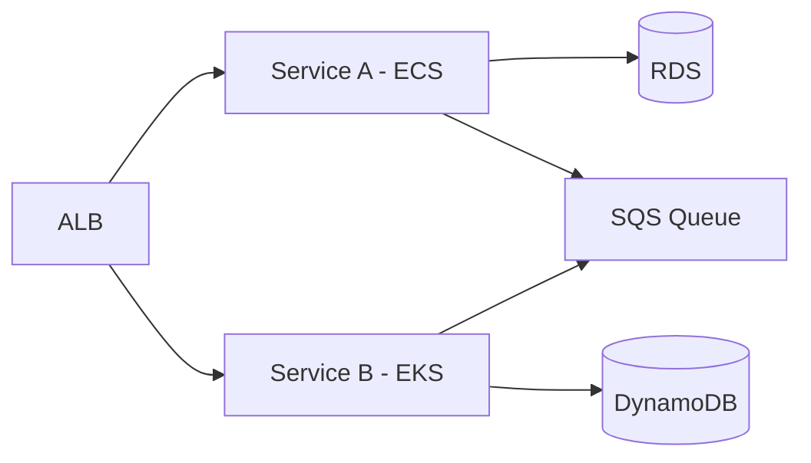
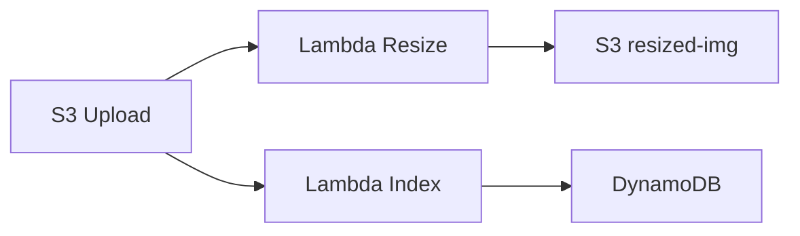
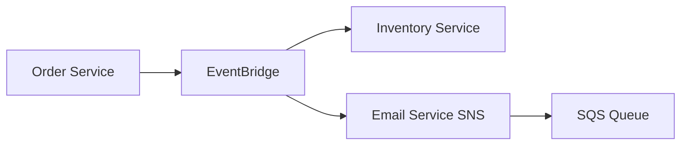
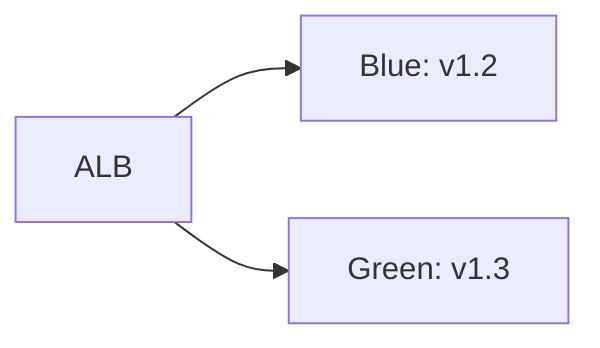
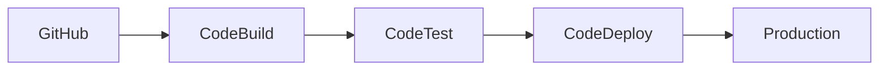

- [[#Microservices on AWS|Microservices on AWS]]
- [[#Serverless Architecture|Serverless Architecture]]
- [[#Event-Driven Architecture|Event-Driven Architecture]]
- [[#High Availability (HA)|High Availability (HA)]]
- [[#Blue-Green Deployment|Blue-Green Deployment]]
- [[#Caching Strategies|Caching Strategies]]
- [[#CI/CD Pipelines|CI/CD Pipelines]]
- [[#Key Takeaways|Key Takeaways]]

# AWS Architecture Patterns - Quick Revision Guide

## Microservices on AWS
**What it is**  
Decoupled services with independent deployment, scaling, and data stores.

**Core Use Cases**  
- Monolith decomposition  
- Team autonomy (e.g., product teams owning services)  
- Independent scaling of high-traffic components  

**Key Concepts**  
- Service Discovery (Cloud Map, Route 53)  
- API Gateway for cross-service communication  
- Data pattern: Database per service vs shared read replicas  

**Architecture**  

**When to Use**  
- Teams with clear domain ownership  
- Variable traffic patterns per service  

**When NOT to Use**  
- Tightly coupled logic  
- Small teams with limited ops bandwidth  

**Scaling**  
- ECS/EKS auto-scaling groups  
- Service-level RDS read replicas  

**Security**  
- VPC isolation between services  
- IAM roles for service-to-service auth  

**Cost Opto**  
- Use Fargate to avoid node management  
- Spot Instances for batch-processing services  

**Interview Qs**  
- *How to handle distributed transactions?*  
- *Service discovery vs direct IP connections?*  

**Real-World Ex**  
E-commerce platform: Catalog service (ECS), Payment service (EKS), Order service (Lambda)

---

## Serverless Architecture
**What it is**  
Event-driven compute with Lambda, API Gateway, and managed services.

**Core Use Cases**  
- API backends  
- Data pipelines  
- Asynchronous processing  

**Key Concepts**  
- Cold starts vs Provisioned Concurrency  
- Lambda layers for shared code  
- Event source mappings (S3, DynamoDB, SQS)  

**Architecture**  

**When to Use**  
- Stateless, event-driven workloads  
- Unpredictable traffic spikes  

**When NOT to Use**  
- Long-running tasks (>15 min)  
- Heavy memory/CPU requirements  

**Scaling**  
- Concurrent executions (default 1000+)  
- Auto-scaled by AWS  

**Security**  
- Lambda execution role  
- VPC for private subnet access  

**Cost Opto**  
- Use **Power Tuning** to optimize memory/duration  
- DLQ for failed invocations  

**Interview Qs**  
- *How to handle state in serverless?*  
- *Lambda duration vs memory tradeoffs?*  

**Real-World Ex**  
Image processing pipeline: S3 → Lambda (thumbnails) → CloudFront  

---

## Event-Driven Architecture
**What it is**  
Decoupled components communicating via events (SNS, EventBridge, SQS).

**Core Use Cases**  
- Async communication  
- Fan-out patterns  
- Integration hubs  

**Key Concepts**  
- EventBridge rules for routing  
- SNS for fan-out  
- SQS for durable queues  

**Architecture**  

**When to Use**  
- Loose coupling required  
- Fan-out to multiple consumers  

**When NOT to Use**  
- Synchronous response needed  
- Strong consistency requirements  

**Scaling**  
- EventBridge processes millions of events/sec  
- SQS auto-scales with throughput  

**Security**  
- EventBridge schema validation  
- SNS topic policies  

**Cost Opto**  
- Use **EventBridge Pipes** for low-latency routing  

**Interview Qs**  
- *Eventual consistency challenges?*  
- *DLQ strategy for critical events?*  

**Real-World Ex**  
Order placement: Order Service → EventBridge → Inventory (Lambda) + Email (SNS)  

---

## High Availability (HA)
**What it is**  
Designing systems to survive component failures with minimal downtime.

**Patterns**  
- **Multi-AZ**: RDS Multi-AZ, ALB cross-zone LB  
- **Multi-Region**: Active-active vs active-passive DR  

**Key Concepts**  
- AZ outage duration: ~60-120 mins  
- RTO/RPO definitions  

**Multi-AZ vs Multi-Region**  
| **Multi-AZ**          | **Multi-Region**               |
|-----------------------|--------------------------------|
| Same geographic area  | Different geographic areas     |
| < 2 ms latency        | 50-200 ms latency              |
| Cost-effective HA     | Disaster recovery              |
| Use for: DB HA        | Use for: DR, global apps       |

**Best Practices**  
- ALB with targets in all AZs  
- RDS Multi-AZ with synchronous replication  
- S3 cross-region replication for DR  

**Interview Qs**  
- *RTO vs RPO differences?*  
- *ALB health check strategies?*  

**Real-World Ex**  
Financial app: Multi-AZ RDS + cross-region S3 backups  

---

## Blue-Green Deployment
**What it is**  
Instant rollback by switching traffic between two identical environments.

**Key Concepts**  
- Identical infrastructure  
- Route 53 weighted routing or ALB target groups  

**Architecture**  

**When to Use**  
- Critical systems requiring instant rollback  
- Large monolithic apps  

**Tradeoffs**  
- 2x infrastructure cost during deployment  
- Data migration complexity  

**Best Practices**  
- Use **CodeDeploy** for automation  
- Database migration scripts in deployment  

**Interview Qs**  
- *How to handle DB schema changes?*  
- *Cost impact vs rolling deployments?*  

**Real-World Ex**  
SaaS platform: Blue-Green via ALB target groups + CloudFormation  

---

## Caching Strategies
**What it is**  
Placing cache layers to reduce DB/load latency.

**Patterns**  
- **Read-through**: App → Cache → DB  
- **Write-through**: App → Cache → DB  
- **Write-behind**: App → Cache → DB async  

**Services**  
- ElastiCache (Redis/Memcached)  
- CloudFront (CDN)  
- DAX (DynamoDB accelerator)  

**Key Concepts**  
- TTL management  
- Cache invalidation strategies  

**Cost Opto**  
- Use **Redis Cluster Mode** for sharding  
- **DAX** for DynamoDB read-heavy apps  

**Interview Qs**  
- *Cache stampedes mitigation?*  
- *When to use Redis vs Memcached?*  

**Real-World Ex**  
E-commerce product catalog: CloudFront → ElastiCache → RDS  

---

## CI/CD Pipelines
**What it is**  
Automated code-to-production workflow.

**Core Services**  
- CodePipeline (orcent)  
- CodeBuild  
- CodeDeploy  

**Architecture**  

**Best Practices**  
- **Infrastructure as Code** (CloudFormation/CDK)  
- **Canary deployments** for risk mitigation  
- **Security scanning** in build phase  

**Interview Qs**  
- *Trunk-based vs feature branching?*  
- *Handling secrets in pipelines?*  

**Real-World Ex**  
Microservice: GitHub → CodeBuild (Docker) → ECS via CodeDeploy  

---

## Key Takeaways
1. **Match pattern to workload**: Stateless → Lambda; Data-heavy → RDS/DynamoDB
2. **Tradeoffs matter**: Cost vs availability, consistency vs latency
3. **Security by default**: IAM roles, VPC isolation, encryption
4. **Automate everything**: IaC, CI/CD, auto-scaling policies
5. **Design for failure**: AZ/Region outages, throttling, rollbacks
